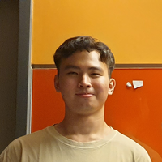
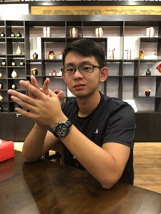
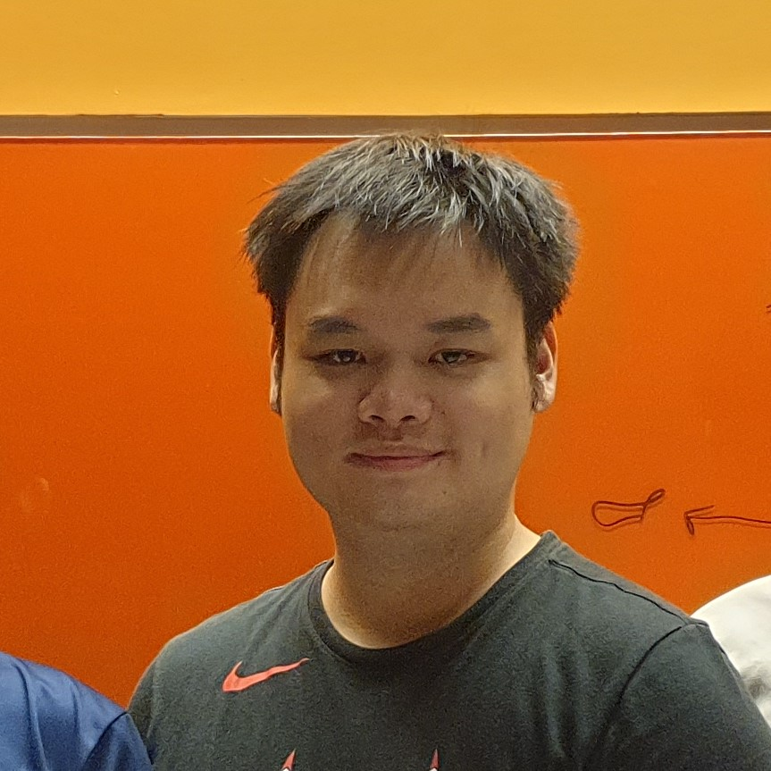
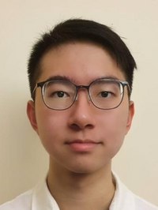

We are a team based in the [School of Computing, National University of Singapore](http://www.comp.nus.edu.sg).

You can reach us at our respective emails as shown below.

## Project Team

### Amos Tan Yan Heng

[[github](https://github.com/atyhamos)][[portfolio](team/atyhamos.md)]

* Role: UI Expert
* Responsibilities: Be most familiar with UI component, ensure quality and vision of product is maintained throughout iterations

### Liao Keng I

[[github](https://github.com/KengXIII)][[portfolio](team/kengxiii.md)]

* Role: GitHub Expert
* Responsibilities: Help other team members with matters related to GitHub

### Ng Hong Jie Ryan

[[github](https://github.com/nhjryan)][[portfolio](team/nhjryan.md)]

* Role: Team Lead
* Responsibilities: Be most familiar with documentation and tracks deadlines, ensuring quality of deliverables

### Ong Ting Rui, Brandon

[[github](https://github.com/botr99)][[portfolio](team/botr99.md)]

* Role: Testing Developer
* Responsibilities: Ensures the testing of the project is done properly and on time

### Wei Yangken

[[github](https://github.com/ykwei7)][[portfolio](team/ykwei7.md)]

* Role: Developer
* Responsibilities: In charge of defining, assigning, and tracking project tasks
