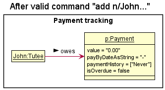
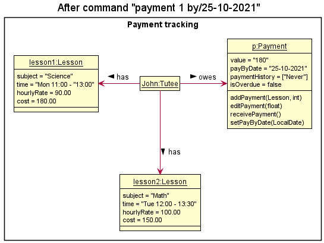
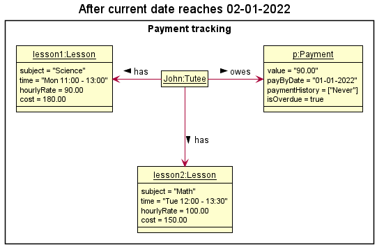
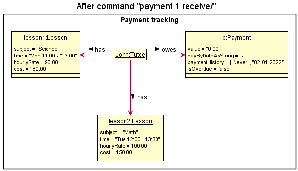

* Table of Contents
{:toc}

--------------------------------------------------------------------------------------------------------------------

## **Acknowledgements**

* {list here sources of all reused/adapted ideas, code, documentation, and third-party libraries -- include links to the original source as well}

--------------------------------------------------------------------------------------------------------------------

## **Setting up, getting started**

Refer to the guide [_Setting up and getting started_](SettingUp.md).

--------------------------------------------------------------------------------------------------------------------

## **Design**

:bulb: **Tip:** The `.puml` files used to create diagrams in this document can be found in the [diagrams](https://github.com/AY2122S1-CS2103T-F12-3/tp/tree/master/docs/diagrams/) folder. Refer to the [_PlantUML Tutorial_ at se-edu/guides](https://se-education.org/guides/tutorials/plantUml.html) to learn how to create and edit diagrams.

### Architecture

The ***Architecture Diagram*** given above explains the high-level design of the App.

Given below is a quick overview of main components and how they interact with each other.

**Main components of the architecture**

**`Main`** has two classes called [`Main`](https://github.com/AY2122S1-CS2103T-F12-3/tp/blob/master/src/main/java/seedu/address/Main.java) and [`MainApp`](https://github.com/AY2122S1-CS2103T-F12-3/tp/blob/master/src/main/java/seedu/address/MainApp.java). It is responsible for,
* At app launch: Initializes the components in the correct sequence, and connects them up with each other.
* At shut down: Shuts down the components and invokes cleanup methods where necessary.

[**`Commons`**](#common-classes) represents a collection of classes used by multiple other components.

The rest of the App consists of four components.

* [**`UI`**](#ui-component): The UI of the App.
* [**`Logic`**](#logic-component): The command executor.
* [**`Model`**](#model-component): Holds the data of the App in memory.
* [**`Storage`**](#storage-component): Reads data from, and writes data to, the hard disk.

**How the architecture components interact with each other**

The *Sequence Diagram* below shows how the components interact with each other for the scenario where the user issues the command `delete 1`.

Each of the four main components (also shown in the diagram above),

* defines its *API* in an `interface` with the same name as the Component.
* implements its functionality using a concrete `{Component Name}Manager` class (which follows the corresponding API `interface` mentioned in the previous point.

For example, the `Logic` component defines its API in the `Logic.java` interface and implements its functionality using the `LogicManager.java` class which follows the `Logic` interface. Other components interact with a given component through its interface rather than the concrete class (reason: to prevent outside component's being coupled to the implementation of a component), as illustrated in the (partial) class diagram below.

The sections below give more details of each component.

### UI component

The **API** of this component is specified in [`Ui.java`](https://github.com/AY2122S1-CS2103T-F12-3/tp/blob/master/src/main/java/seedu/address/ui/Ui.java)

The UI consists of a `MainWindow` that is made up of parts e.g.`CommandBox`, `ResultDisplay`, `TuteeListPanel`, `StatusBarFooter` etc. All these, including the `MainWindow`, inherit from the abstract `UiPart` class which captures the commonalities between classes that represent parts of the visible GUI.

The `UI` component uses the JavaFx UI framework. The layout of these UI parts are defined in matching `.fxml` files that are in the `src/main/resources/view` folder. For example, the layout of the [`MainWindow`](https://github.com/AY2122S1-CS2103T-F12-3/tp/blob/master/src/main/java/seedu/address/ui/MainWindow.java) is specified in [`MainWindow.fxml`](https://github.com/AY2122S1-CS2103T-F12-3/tp/blob/master/src/main/resources/view/MainWindow.fxml)

The `UI` component,

* executes user commands using the `Logic` component.
* listens for changes to `Model` data so that the UI can be updated with the modified data.
* keeps a reference to the `Logic` component, because the `UI` relies on the `Logic` to execute commands.
* depends on some classes in the `Model` component, as it displays `Tutee` object residing in the `Model`.

### Logic component

**API** : [`Logic.java`](https://github.com/AY2122S1-CS2103T-F12-3/tp/blob/master/src/main/java/seedu/address/logic/Logic.java)

Here's a (partial) class diagram of the `Logic` component:

How the `Logic` component works:
1. When `Logic` is called upon to execute a command, it uses the `TrackOParser` class to parse the user command.
1. This results in a `Command` object (more precisely, an object of one of its subclasses e.g., `AddCommand`) which is executed by the `LogicManager`.
1. The command can communicate with the `Model` when it is executed (e.g. to add a tutee).
1. The result of the command execution is encapsulated as a `CommandResult` object which is returned back from `Logic`.

The Sequence Diagram below illustrates the interactions within the `Logic` component for the `execute("delete 1")` API call.

:information_source: **Note:** The lifeline for `DeleteCommandParser` should end at the destroy marker (X) but due to a limitation of PlantUML, the lifeline reaches the end of diagram.

Here are the other classes in `Logic` (omitted from the class diagram above) that are used for parsing a user command:

How the parsing works:
* When called upon to parse a user command, the `TrackOParser` class creates an `XYZCommandParser` (`XYZ` is a placeholder for the specific command name e.g., `AddCommandParser`) which uses the other classes shown above to parse the user command and create a `XYZCommand` object (e.g., `AddCommand`) which the `TrackOParser` returns back as a `Command` object.
* All `XYZCommandParser` classes (e.g., `AddCommandParser`, `DeleteCommandParser`, ...) inherit from the `Parser` interface so that they can be treated similarly where possible e.g, during testing.

### Model component
**API** : [`Model.java`](https://github.com/AY2122S1-CS2103T-F12-3/tp/blob/master/src/main/java/seedu/address/model/Model.java)

The `Model` component,

* stores the address book data i.e., all `Tutee` objects (which are contained in a `UniqueTuteeList` object).
* stores the currently 'selected' `Tutee` objects (e.g., results of a search query) as a separate _filtered_ list which is exposed to outsiders as an unmodifiable `ObservableList<Tutee>` that can be 'observed' e.g. the UI can be bound to this list so that the UI automatically updates when the data in the list change.
* stores a `UserPref` object that represents the user’s preferences. This is exposed to the outside as a `ReadOnlyUserPref` objects.
* does not depend on any of the other three components (as the `Model` represents data entities of the domain, they should make sense on their own without depending on other components)

:information_source: **Note:** An alternative (arguably, a more OOP) model is given below. It has a `Tag` list in `TrackO`, which `Tutee` references. This allows `TrackO` to only require one `Tag` object per unique tag, instead of each `Tutee` needing their own `Tag` objects. 

### Storage component

**API** : [`Storage.java`](https://github.com/AY2122S1-CS2103T-F12-3/tp/blob/master/src/main/java/seedu/address/storage/Storage.java)

The `Storage` component,
* can save both address book data and user preference data in json format, and read them back into corresponding objects.
* inherits from both `TrackOStorage` and `UserPrefStorage`, which means it can be treated as either one (if only the functionality of only one is needed).
* depends on some classes in the `Model` component (because the `Storage` component's job is to save/retrieve objects that belong to the `Model`)

### Common classes

Classes used by multiple components are in the `seedu.addressbook.commons` package.

--------------------------------------------------------------------------------------------------------------------

## **Implementation**

This section describes some noteworthy details on how certain features are implemented.

### Get feature

#### Rationale

The initial implementation showcases all the information on the tutee card viewer.
However, when more information of a tutee is added, it may clog up the viewer with
less relevant information. The `get` feature hence solves this through only
listing this additional information when necessary.

#### Current Implementation

The current implementation uses indexing to identify
the tutee selected. For instance, `get 2` will list the information
of the second tutee found on the list. The information to be listed is based on
`Tutee#toString()` which contains additional information on fields such as `remark` and `lesson`.

#### Design considerations:

**Aspect: How `get` executes:**

* **Current execution** Prints information of tutee to output terminal.
    * Pros: Displays information on output terminal.
    * Cons: May be less aesthetic compared to initial implementation.

### Payment tracking feature

`Payment` keeps track of the payment details of the tutee, such as the amount of fees incurred, the payment due date and the payment history.

#### Rationale

A tutor may miscalculate fees, forget payment due dates, or have too many tutees to keep track of their payment information manually.

#### Current Implementation

The payment tracking feature is facilitated by `Payment`, `PaymentCommandParser`, `PaymentAddCommand` `PaymentSetAmountCommand`, `PaymentSetDateCommand` and `PaymentReceiveCommand`.

`Payment` contains:
* `value`  — the amount of fees incurred by the Tutee since the last payment date
* `payByDate`  — the date which the Tutee has to pay the `value` by
* `paymentHistory`  — a list of dates which the Tutee previously paid on
* `isOverdue` — a boolean flag which denotes if the payment is overdue

Parsing the user's input through `PaymentCommandParser`, the user may generate any one of the following commands:
* `PaymentAddCommand`  — Adds the cost of the lesson's fees to the tutee's current payment amount due
* `PaymentSetAmountCommand`  — Sets the payment amount due for the tutee to the specified amount
* `PaymentSetDateCommand`  — Sets the pay-by date for the tutee to the specified date
* `PaymentReceiveCommand`  — Resets the tutee's incurred fees and pay-by-date, and updates their payment history

The following steps showcase how a tutee's payment details are managed by the user.

Step 1. The user adds a new `Tutee` John to Track-O and the `Payment` object is initialized with default values.

    

Step 2. After adding lessons to John, the user executes "payment 1 lesson/1", where John is index `1` in the `Tutee` list, and `lesson1` is index `1` in the `Lesson` list.

    

Step 3. The user executes "payment 1 amount/90" after accidentally overcharging fees previously.

    

Step 4. The user executes "payment 1 by/01-01-2022", updating the `Payment#payByDate` for John.

    

Step 5. In the event that the current date passes the `Payment#payByDate`, the `Payment#isOverdue` flag will turn `true`.

    

Step 6. The user executes `payment 1 receive` and receives John's payment, updating the `Payment#paymentHistory` with the current date, and resetting `Payment#payByDate`, and `Payment#value` respectively.

    

#### Design considerations

**Aspect: How lesson fees are added to payment amounts**

* **Option 1 (current choice):** Add a tutee's lesson's cost to their current payment amount due.
    * Pros: Easy to implement and command would be short.
    * Pros: Would be commonly used to increment tutee's payments directly after a lesson.
    * Cons: Adding multiples of a lesson's cost requires multiple copies of the same command (i.e adding 3 lesson's worth of fees at once).

* **Option 2:** Add a tutee's lesson's cost multiplied by an integer parameter to their current payment amount due
    * Pros: The tutor can easily add multiples of a lesson's cost to a tutee.
    * Cons: The additional integer parameter would require another layer of parsing and validation checking.
    * Cons: Command would be more lengthy as it requires 3 keywords to execute (payment, lesson, integer).

**Aspect: How payment due dates are managed**

* **Option 1 (current choice):** Set a specified payment due date manually for a tutee.
    * Pros: Gives the user the choice to set a payment due date, as not all tutees may require tracking of payments if they pay immediately after a lesson.
    * Cons: Requires more effort for the user to set payment due dates for every tutee, if they require so.

* **Option 2:** Set the payment due date exactly 1 week from the date the tutee last paid.
    * Pros: The tutor need not manually set due dates if the tutees are to pay weekly.
    * Cons: Different tutors collect payments at different times (i.e monthly, biweekly).
    * Cons: Lessons may not occur every week, so the payment due date is subject to manual change quite often, making its automatic nature redundant.

### Schedule

`Schedule` helps to list the weekly lessons of the tutor.

#### Rationale

A tutor may be teaching many lessons to many tutees. It may be difficult to track their upcoming lessons, hence `Schedule` solves these through listing these upcoming lessons.

#### Current Implementation

The `Schedule` class consists of a `TreeMap<Lesson, String>` that stores a set of lessons that is sorted by day of occurrence and start time.

On the start-up of Track-O, before the tutor inputs any commands, the tutee list is iterated through and each `Lesson` of each tutee, along with their name, is added to the `TreeMap<Lesson, String>` set of lessons.

*Figure: Structure of `Schedule`*

The `TreeMap<Lesson, String>` set of lessons will be updated after every execution of commands that modify a tutee's lessons or name. The activity diagram below shows how `Schedule` is involved when an `addlesson` command is executed.

*Figure: Steps involved in adding a lesson*

The tutor's schedule can be accessed via the `schedule` command. The sorted lessons will be displayed.

#### Design considerations:

**Aspect: How the schedule is to be stored**

* **Option 1 (current choice):** Retrieves the schedule by iterating through the `TuteeList` on start-up.
    * Pros: Easy to implement.
    * Cons: May have performance issues when the number of tutees and the number of lessons become excessively large.

* **Option 2:** Retrieves the schedule from another JSON file (e.g: `schedule.json`)
    * Pros: The tutor can view their schedule directly on their hard disk without starting up Track-O.
    * Cons: Any changes to the schedule through lesson commands have to be updated in both `tracko.json` and `schedule.json`. If the user manually edits `schedule.json` and not edit `tracko.json`, it is likely to cause issues in processing both JSON files, resulting in the data in both JSON files to be wiped out.

### Education Level of tutees

Education level is a compulsory parameter when adding a new tutee. It requires the flag `l/`,
followed by the abbreviation of the respective education level. Abbreviations can only contain 2 characters:
the first letter of the education level in lowercase, followed by the year of study.

#### Supported Education Levels

* Primary: 1 to 6
* Secondary: 1 to 5
* Junior College: 1 to 2

#### Design
The `value` field of education level in Tutee class is in the abbreviation form.
In `TuteeCard`, the string displayed is `stringRepresentation`,
which is the returned value of the `parse` method in Level class, using `value` as the parameter.
For example, `stringRepresentation` of `p5` is `Primary 5`.

Both `value` and `stringRepresentation` are fields belonging to Level.
This is designed for better readability in displaying tutees. Having two fields ensures that the
abbreviation can be obtained using `getLevel()` method in Tutee, instead of parsing the string representation back
to its abbreviated form. In future implementations, we can use the abbreviations to do comparison and sort tutees according to their
education level.

#### Parse method
The `parse` method splits the string parameter into a charArray and switches case according to the first char.
Due to the regex validation when creating tutee, the first char will be a valid character so no exceptions are thrown here.

#### Restrictions
1. The first character of the education level has to be lowercase and one of the 3 alphabets: p, s, j.
2. The second character has to be a valid year of study of its respective level as defined in the constraint message.

Failing either restriction will result in the constraint message showing up in the console component,
and the tutee will not be created/modified.

--------------------------------------------------------------------------------------------------------------------

## **Documentation, logging, testing, configuration, dev-ops**

* [Documentation guide](Documentation.md)
* [Testing guide](Testing.md)
* [Logging guide](Logging.md)
* [Configuration guide](Configuration.md)
* [DevOps guide](DevOps.md)

--------------------------------------------------------------------------------------------------------------------

## **Appendix: Requirements**

### Product scope

**Target user profile**:

Private tutors who have many tutees of different educational levels, teaching different subjects.

**Value proposition**:

The product manages the information of tutees on a collated digital platform, as opposed to storing it physically. Information specific to the progress of individual students can be tracked.

Tutors will have an overview of each individual tutee’s progress. As such, they would not have to manually keep track of all the information, which could lead to errors and be difficult to maintain.

The platform is personalized for private tutors as opposed to other audiences (like tuition centres) as the app tracks the progress of individual tutees more closely and allows for automatic calculation of tuition fees.

### User stories

| Priority | As a …​                                    | I want to …​                   | So that I can…​                                                        |
| -------- | ------------------------------------------ | ------------------------------ | ---------------------------------------------------------------------- |
| `* * *`  | first-time user                            | view all the commands I need to learn  | start using the app right away. |
| `* * *`  | private tutor with many students           | list out my tutee's information in an overview | plan my lessons effectively. |
| `* * *`  | private tutor                              | add information about my tutees easily | keep track of their progress. |
| `* * *`  | private tutor with many students           | find information of one specific student through his name. | |
| `* * *`  | recently fired tutor                       | delete all the data of a particular student. | |
| `* * *`  | tutor with many existing tuition classes   | add a class that does not clash with existing classes   | plan my time more effectively. |
| `* * *`  | forgetful tutor                            | know where my tutee stays | find my way to the correct location. |
| `* * *`  | private tutor who teaches tutees of various subjects and at various levels | tag the tutees by level and/or subject (e.g: P5 Math) | search for all tutees related to the level/subject easily. |
| `* * *`  | private tutor                              | delete all data at one go (maybe with reconfirmation before clearing everything) | start afresh. |
| `* *`    | careless user                              | edit each portion easily | minimize mistakes in storing data. |
| `* *`    | careless user                              | know what I typed wrongly when I enter a wrong command. | |
| `* *`    | organized tutor                            | know which students I will be teaching later | prepare materials accordingly. |
| `* *`    | disorganized tutor                         | see my schedule for the week | plan for unconfirmed tuition time slots. |
| `* *`    | forgetful tutor                            | see the status of each student’s payment beforehand | remind them about payment collection during the class. |
| `* *`    | private tutor                              | add and delete lessons for my tutee | cater for last minute changes to plans |
| `* *`    | disorganized tutor                         | keep track of the (contact numbers of) students that have not paid for this month’s payment | contact them to pay up. |
| `*`      | first-time user                            | experiment with the basic commands with sample data | familiarise myself with the commands in a safe space. |
| `*`      | first-time user                            | clear all sample data | start adding in my own data. |
| `*`      | forgetful tutor                            | know what's the current upcoming tuition session | plan for it. |
| `*`      | private tutor with an increasing number of students | sort my students by specific fields, such as lesson date or level and school of student. | so that I can find them easily |
| `*`      | first-time user                            | import all my existing data into the app when I first start it up | quickly set-up the app. |

### Use cases

(For all use cases below, the **System** is `Track-o` and the **Actor** is the `user`, unless specified otherwise)

**UC01: Seek help on the usage of commands**

**MSS**
1. User requests for help regarding how to use the commands.
2. System provides the usage of commands.

   Use case ends.

 

**UC02: Import existing data**

**MSS**
1. User requests to import existing data.
2. System processes and shows the data.

   Use case ends.

**Extensions**
* 1a. Data is of an improper format.
    * 1a1. System shows an error message.

      Use case resumes at step 1.

 

**UC03: Add a tutee**

**MSS**
1. User requests to add a tutee by providing the details of the tutee.
2. System adds the tutee.

   Use case ends.

**Extensions**
* 1a. Some compulsory details of the tutee are not included.
    * 1a1. System shows an error message.

      Use case resumes at step 1.

 

**UC04: View all tutees**

**MSS**
1. User requests to view all tutees.
2. System shows a list of tutees.

   Use case ends.

 

**UC05: Delete a tutee**

**MSS**
1. User requests to list tutees (UC04)
2. System shows a list of tutees
3. User requests to delete a specific tutee in the list
4. System deletes the tutee

   Use case ends.

**Extensions**

* 3a. The given index is invalid.
    * 3a1. System shows an error message.

      Use case resumes at step 2.

 

**UC06: View a specific tutee**

**MSS**
1. User requests to list tutees. (UC04)
2. System shows a list of tutees.
3. User requests to view a specific tutee.
4. System shows that specific tutee.

   Use case ends.

**Extensions**

* 3a. The given index is invalid.
    * 3a1. System shows an error message.

      Use case resumes at step 2.

 

**UC07: Search for tutees by their name**

**MSS**
1. User requests to list tutees. (UC04)
2. System shows a list of tutees.
3. User requests to search for tutees by their name.
4. System shows a list of tutees matching this name.

   Use case ends.

 

**UC08: Filter tutees by their level or subject**

**MSS**
1. User requests to list tutees. (UC04)
2. System shows a list of tutees.
3. User requests to filter tutees by their level or subject.
4. System shows a filtered list of tutees.

   Use case ends.

 

**UC09: Edit a specific tutee**

**MSS**
1. User requests to list tutees. (UC04)
2. System shows a list of tutees.
3. User requests to edit a specific tutee.
4. System edits that specific tutee.

   Use case ends.

**Extensions**

* 3a. The given index is invalid.
    * 3a1. System shows an error message.

      Use case resumes at step 2.

* 3b. No details of the tutee are provided.
    * 3b1. System shows an error message.

      Use case resumes at step 2.

 

**UC10: View the schedule for the week**

**MSS**
1. User requests to view his/her schedule for the week.
2. System shows the schedule.

   Use case ends.

 

**UC11: View existing payment details of tutee**

**MSS**
1. User requests to list tutees. (UC04)
2. System shows a list of tutees.
3. User requests to view payment details of a specific tutee.

   Use case ends.

   **Extensions**

* 3a. The given index is invalid.
    * 3a1. System shows an error message.

      Use case resumes at step 2.
 

**UC12: Add lesson fees to payment owed by tutee**

**MSS**
1. User requests to list tutees. (UC04)
2. System shows a list of tutees.
3. User requests to view payment details of tutee. (UC11)
4. User selects lesson and adds fees of lesson to existing fees.
5. System shows new updated payment details.

   Use case ends.

   **Extensions**

* 4a. The given lesson index is invalid.
    * 4a1. System shows an error message.

      Use case resumes at step 2.

* 4b. The given lesson index is wrong.
    * 4b1. System shows incorrect updated payment details.
    * 4b2. User manually edits data to revert payment details. (UC13)

      Use case resumes at step 2.
 

**UC13: Manually update payment fees owed by tutee**

**MSS**
1. User requests to list tutees. (UC04)
2. System shows a list of tutees.
3. User requests to view payment details of tutee. (UC11)
4. User updates fees to new desired amount.
5. System shows new updated payment details.

   Use case ends.

   **Extensions**

* 5a. The given amount is invalid.
    * 5a1. System shows an error message.

      Use case resumes at step 2.

* 5b. The given amount is wrong.
    * 5b1. System shows incorrect updated payment details.
    * 5b2. User manually updates payment fees to new correct amount.

      Use case resumes at step 4.
       

**UC14: Receive payment fees owed by tutee**

**MSS**
1. User requests to list tutees. (UC04)
2. System shows a list of tutees.
3. User requests to view payment details of tutee. (UC11)
4. User sets fees of tutee as received.
5. System shows new updated payment details.

   Use case ends.

   **Extensions**

* 4a. Date is provided.
    * 4a1. System updates and shows the new date to make payment by.

* 4b. Date is not provided.
    * 4a1. System updates and removes the date to make payment by.

      Use case resumes at step 4.
       

**UC15: Find tutees with overdue payment**

**MSS**
1. User requests to list tutees. (UC04)
2. System shows a list of tutees.
3. User requests to find tutees with overdue payment.
5. System shows list of tutees that are overdue.

   Use case ends.

**UC16: Clear all data**

**MSS**
1. User requests to clear all data.
2. System clears all data.

   Use case ends.

### Non-Functional Requirements

1. Should work on any _mainstream OS_ as long as it has Java `11` or above installed.
2. Should be able to hold up to 1000 tutees without a noticeable sluggishness in performance for typical usage.
3. A user with above average typing speed for regular English text (i.e. not code, not system admin commands) should be able to accomplish most of the tasks faster using commands than using the mouse.
4. The data should not be made accessible to anyone else other than the user.
5. The system should be usable by a user who has never used a task manager, schedule tracker, or other forms of similar applications.

### Glossary

* **Mainstream OS**: Windows, Linux, Unix, OS-X
* **Education level**: Education level of an individual in the context of Singapore. Supported education levels are contextualized to the primary, secondary and JC level. For instance, `P5` refers to Primary 5, `JC2` refers to Junior College Year 2
* **Database**: Storage on local system

--------------------------------------------------------------------------------------------------------------------

## **Appendix: Instructions for manual testing**

Given below are instructions to test the app manually.

:information_source: **Note:** These instructions only provide a starting point for testers to work on;
testers are expected to do more *exploratory* testing.

### Launch and shutdown

1. Initial launch

    1. Download the jar file and copy into an empty folder

    1. Double-click the jar file Expected: Shows the GUI with a set of sample contacts. The window size may not be optimum.

1. Saving window preferences

    1. Resize the window to an optimum size. Move the window to a different location. Close the window.

    1. Re-launch the app by double-clicking the jar file. 
       Expected: The most recent window size and location is retained.

1. _{ more test cases …​ }_

### Deleting a tutee

1. Deleting a tutee while all tutees are being shown

    1. Prerequisites: List all tutees using the `list` command. Multiple tutees in the list.

    1. Test case: `delete 1` 
       Expected: First contact is deleted from the list. Details of the deleted contact shown in the status message. Timestamp in the status bar is updated.

    1. Test case: `delete 0` 
       Expected: No tutee is deleted. Error details shown in the status message. Status bar remains the same.

    1. Other incorrect delete commands to try: `delete`, `delete x`, `...` (where x is larger than the list size) 
       Expected: Similar to previous.

1. _{ more test cases …​ }_

### Saving data

1. Dealing with missing/corrupted data files

    1. Application will launch with an empty file
    2. Update the file as necessary to include the relevant tutee information.

