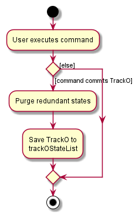

* Table of Contents
{:toc}

--------------------------------------------------------------------------------------------------------------------

## **Acknowledgements**

* {list here sources of all reused/adapted ideas, code, documentation, and third-party libraries -- include links to the original source as well}

--------------------------------------------------------------------------------------------------------------------

## **Setting up, getting started**

Refer to the guide [_Setting up and getting started_](SettingUp.md).

--------------------------------------------------------------------------------------------------------------------

## **Design**

:bulb: **Tip:** The `.puml` files used to create diagrams in this document can be found in the [diagrams](https://github.com/se-edu/addressbook-level3/tree/master/docs/diagrams/) folder. Refer to the [_PlantUML Tutorial_ at se-edu/guides](https://se-education.org/guides/tutorials/plantUml.html) to learn how to create and edit diagrams.

### Architecture

The ***Architecture Diagram*** given above explains the high-level design of the App.

Given below is a quick overview of main components and how they interact with each other.

**Main components of the architecture**

**`Main`** has two classes called [`Main`](https://github.com/se-edu/addressbook-level3/tree/master/src/main/java/seedu/address/Main.java) and [`MainApp`](https://github.com/se-edu/addressbook-level3/tree/master/src/main/java/seedu/address/MainApp.java). It is responsible for,
* At app launch: Initializes the components in the correct sequence, and connects them up with each other.
* At shut down: Shuts down the components and invokes cleanup methods where necessary.

[**`Commons`**](#common-classes) represents a collection of classes used by multiple other components.

The rest of the App consists of four components.

* [**`UI`**](#ui-component): The UI of the App.
* [**`Logic`**](#logic-component): The command executor.
* [**`Model`**](#model-component): Holds the data of the App in memory.
* [**`Storage`**](#storage-component): Reads data from, and writes data to, the hard disk.

**How the architecture components interact with each other**

The *Sequence Diagram* below shows how the components interact with each other for the scenario where the user issues the command `delete 1`.

Each of the four main components (also shown in the diagram above),

* defines its *API* in an `interface` with the same name as the Component.
* implements its functionality using a concrete `{Component Name}Manager` class (which follows the corresponding API `interface` mentioned in the previous point.

For example, the `Logic` component defines its API in the `Logic.java` interface and implements its functionality using the `LogicManager.java` class which follows the `Logic` interface. Other components interact with a given component through its interface rather than the concrete class (reason: to prevent outside component's being coupled to the implementation of a component), as illustrated in the (partial) class diagram below.

The sections below give more details of each component.

### UI component

The **API** of this component is specified in [`Ui.java`](https://github.com/se-edu/addressbook-level3/tree/master/src/main/java/seedu/address/ui/Ui.java)

The UI consists of a `MainWindow` that is made up of parts e.g.`CommandBox`, `ResultDisplay`, `TuteeListPanel`, `StatusBarFooter` etc. All these, including the `MainWindow`, inherit from the abstract `UiPart` class which captures the commonalities between classes that represent parts of the visible GUI.

The `UI` component uses the JavaFx UI framework. The layout of these UI parts are defined in matching `.fxml` files that are in the `src/main/resources/view` folder. For example, the layout of the [`MainWindow`](https://github.com/se-edu/addressbook-level3/tree/master/src/main/java/seedu/address/ui/MainWindow.java) is specified in [`MainWindow.fxml`](https://github.com/se-edu/addressbook-level3/tree/master/src/main/resources/view/MainWindow.fxml)

The `UI` component,

* executes user commands using the `Logic` component.
* listens for changes to `Model` data so that the UI can be updated with the modified data.
* keeps a reference to the `Logic` component, because the `UI` relies on the `Logic` to execute commands.
* depends on some classes in the `Model` component, as it displays `Tutee` object residing in the `Model`.

### Logic component

**API** : [`Logic.java`](https://github.com/se-edu/addressbook-level3/tree/master/src/main/java/seedu/address/logic/Logic.java)

Here's a (partial) class diagram of the `Logic` component:

How the `Logic` component works:
1. When `Logic` is called upon to execute a command, it uses the `AddressBookParser` class to parse the user command.
1. This results in a `Command` object (more precisely, an object of one of its subclasses e.g., `AddCommand`) which is executed by the `LogicManager`.
1. The command can communicate with the `Model` when it is executed (e.g. to add a tutee).
1. The result of the command execution is encapsulated as a `CommandResult` object which is returned back from `Logic`.

The Sequence Diagram below illustrates the interactions within the `Logic` component for the `execute("delete 1")` API call.

:information_source: **Note:** The lifeline for `DeleteCommandParser` should end at the destroy marker (X) but due to a limitation of PlantUML, the lifeline reaches the end of diagram.

Here are the other classes in `Logic` (omitted from the class diagram above) that are used for parsing a user command:

How the parsing works:
* When called upon to parse a user command, the `AddressBookParser` class creates an `XYZCommandParser` (`XYZ` is a placeholder for the specific command name e.g., `AddCommandParser`) which uses the other classes shown above to parse the user command and create a `XYZCommand` object (e.g., `AddCommand`) which the `AddressBookParser` returns back as a `Command` object.
* All `XYZCommandParser` classes (e.g., `AddCommandParser`, `DeleteCommandParser`, ...) inherit from the `Parser` interface so that they can be treated similarly where possible e.g, during testing.

### Model component
**API** : [`Model.java`](https://github.com/se-edu/addressbook-level3/tree/master/src/main/java/seedu/address/model/Model.java)

The `Model` component,

* stores the address book data i.e., all `Tutee` objects (which are contained in a `UniqueTuteeList` object).
* stores the currently 'selected' `Tutee` objects (e.g., results of a search query) as a separate _filtered_ list which is exposed to outsiders as an unmodifiable `ObservableList<Tutee>` that can be 'observed' e.g. the UI can be bound to this list so that the UI automatically updates when the data in the list change.
* stores a `UserPref` object that represents the user’s preferences. This is exposed to the outside as a `ReadOnlyUserPref` objects.
* does not depend on any of the other three components (as the `Model` represents data entities of the domain, they should make sense on their own without depending on other components)

:information_source: **Note:** An alternative (arguably, a more OOP) model is given below. It has a `Tag` list in the `AddressBook`, which `Tutee` references. This allows `AddressBook` to only require one `Tag` object per unique tag, instead of each `Tutee` needing their own `Tag` objects. 

### Storage component

**API** : [`Storage.java`](https://github.com/se-edu/addressbook-level3/tree/master/src/main/java/seedu/address/storage/Storage.java)

The `Storage` component,
* can save both address book data and user preference data in json format, and read them back into corresponding objects.
* inherits from both `AddressBookStorage` and `UserPrefStorage`, which means it can be treated as either one (if only the functionality of only one is needed).
* depends on some classes in the `Model` component (because the `Storage` component's job is to save/retrieve objects that belong to the `Model`)

### Common classes

Classes used by multiple components are in the `seedu.addressbook.commons` package.

--------------------------------------------------------------------------------------------------------------------

## **Implementation**

This section describes some noteworthy details on how certain features are implemented.

### Education Level of tutees

Education level is a compulsory parameter when adding a new tutee. It requires the flag `l/`, 
followed by the abbreviation of the respective education level. Abbreviations can only contain 2 characters: 
the first letter of the education level in lowercase, followed by the year of study.

#### Supported Education Levels

* Primary: 1 to 6
* Secondary: 1 to 5
* Junior College: 1 to 2

#### Design
The `value` field of education level in Tutee class is in the abbreviation form. 
In `TuteeCard`, the string displayed is `stringRepresentation`, 
which is the returned value of the `parse` method in Level class, using `value` as the parameter. 
For example, `stringRepresentation` of `p5` is `Primary 5`. 

####
Both `value` and `stringRepresentation` are fields belonging to Level.
This is designed for better readability in displaying tutees. Having two fields ensures that the
abbreviation can be obtained using `getLevel()` method in Tutee, instead of parsing the string representation back 
to its abbreviated form. In future implementations, we can use the abbreviations to do comparison and sort tutees according to their
education level.

#### Parse method
The `parse` method splits the string parameter into a charArray and switches case according to the first char.
Due to the regex validation when creating tutee, the first char will be a valid character so no exceptions are thrown here.

#### Restrictions
1. The first character of the education level has to be lowercase and one of the 3 alphabets: p, s, j.
2. The second character has to be a valid year of study of its respective level as defined in the constraint message.

Failing either restriction will result in the constraint message showing up in the console component, 
and the tutee will not be created/modified.

### \[Proposed\] Undo/redo feature

#### Proposed Implementation

The proposed undo/redo mechanism is facilitated by `VersionedAddressBook`. It extends `AddressBook` with an undo/redo history, stored internally as an `addressBookStateList` and `currentStatePointer`. Additionally, it implements the following operations:

* `VersionedAddressBook#commit()` — Saves the current address book state in its history.
* `VersionedAddressBook#undo()` — Restores the previous address book state from its history.
* `VersionedAddressBook#redo()` — Restores a previously undone address book state from its history.

These operations are exposed in the `Model` interface as `Model#commitAddressBook()`, `Model#undoAddressBook()` and `Model#redoAddressBook()` respectively.

Given below is an example usage scenario and how the undo/redo mechanism behaves at each step.

Step 1. The user launches the application for the first time. The `VersionedAddressBook` will be initialized with the initial address book state, and the `currentStatePointer` pointing to that single address book state.

Step 2. The user executes `delete 5` command to delete the 5th tutee in the address book. The `delete` command calls `Model#commitAddressBook()`, causing the modified state of the address book after the `delete 5` command executes to be saved in the `addressBookStateList`, and the `currentStatePointer` is shifted to the newly inserted address book state.

Step 3. The user executes `add n/David …​` to add a new tutee. The `add` command also calls `Model#commitAddressBook()`, causing another modified address book state to be saved into the `addressBookStateList`.

:information_source: **Note:** If a command fails its execution, it will not call `Model#commitAddressBook()`, so the address book state will not be saved into the `addressBookStateList`.

Step 4. The user now decides that adding the tutee was a mistake, and decides to undo that action by executing the `undo` command. The `undo` command will call `Model#undoAddressBook()`, which will shift the `currentStatePointer` once to the left, pointing it to the previous address book state, and restores the address book to that state.

:information_source: **Note:** If the `currentStatePointer` is at index 0, pointing to the initial AddressBook state, then there are no previous AddressBook states to restore. The `undo` command uses `Model#canUndoAddressBook()` to check if this is the case. If so, it will return an error to the user rather
than attempting to perform the undo.

The following sequence diagram shows how the undo operation works:

:information_source: **Note:** The lifeline for `UndoCommand` should end at the destroy marker (X) but due to a limitation of PlantUML, the lifeline reaches the end of diagram.

The `redo` command does the opposite — it calls `Model#redoAddressBook()`, which shifts the `currentStatePointer` once to the right, pointing to the previously undone state, and restores the address book to that state.

:information_source: **Note:** If the `currentStatePointer` is at index `addressBookStateList.size() - 1`, pointing to the latest address book state, then there are no undone AddressBook states to restore. The `redo` command uses `Model#canRedoAddressBook()` to check if this is the case. If so, it will return an error to the user rather than attempting to perform the redo.

Step 5. The user then decides to execute the command `list`. Commands that do not modify the address book, such as `list`, will usually not call `Model#commitAddressBook()`, `Model#undoAddressBook()` or `Model#redoAddressBook()`. Thus, the `addressBookStateList` remains unchanged.

Step 6. The user executes `clear`, which calls `Model#commitAddressBook()`. Since the `currentStatePointer` is not pointing at the end of the `addressBookStateList`, all address book states after the `currentStatePointer` will be purged. Reason: It no longer makes sense to redo the `add n/David …​` command. This is the behavior that most modern desktop applications follow.

The following activity diagram summarizes what happens when a user executes a new command:

#### Design considerations:

**Aspect: How undo & redo executes:**

* **Alternative 1 (current choice):** Saves the entire address book.
  * Pros: Easy to implement.
  * Cons: May have performance issues in terms of memory usage.

* **Alternative 2:** Individual command knows how to undo/redo by
  itself.
  * Pros: Will use less memory (e.g. for `delete`, just save the tutee being deleted).
  * Cons: We must ensure that the implementation of each individual command are correct.

_{more aspects and alternatives to be added}_

### \[Proposed\] Data archiving

_{Explain here how the data archiving feature will be implemented}_

--------------------------------------------------------------------------------------------------------------------

## **Documentation, logging, testing, configuration, dev-ops**

* [Documentation guide](Documentation.md)
* [Testing guide](Testing.md)
* [Logging guide](Logging.md)
* [Configuration guide](Configuration.md)
* [DevOps guide](DevOps.md)

--------------------------------------------------------------------------------------------------------------------

## **Appendix: Requirements**

### Product scope

**Target user profile**:

Private tutors who have many different tutees of different educational levels, teaching different subjects and/or in various different groups.

**Value proposition**:

The product manages the information of tutees on a collated digital platform, as opposed to storing it physically. Information specific to the progress of individual students can be tracked

Tutors will have an overview of each individual tutee’s progress. As such, they would not have to manually keep track of all the information, which could lead to errors and be difficult to maintain.

The platform is personalized for private tutors as opposed to other audiences (like tuition centres) as the app tracks the progress of individual tutees more closely and specific relevant information (e.g exam dates of particular student)

The application does not offer functionality for contacting tutees.

### User stories

| Priority | As a …​                                    | I want to …​                   | So that I can…​                                                        |
| -------- | ------------------------------------------ | ------------------------------ | ---------------------------------------------------------------------- |
| `* * *`  | first-time user                            | view all the commands I need to learn  | start using the app right away. |
| `* * *`  | private tutor with many students           | list out my tutee's information in an overview | plan my lessons effectively. |
| `* * *`  | private tutor                              | add information about my tutees easily | keep track of which education level they are at. |
| `* * *`  | private tutor with many students           | get information about one specific student by his name. | |
| `* * *`  | recently fired tutor                       | delete or archive all the data of a particular student. | |
| `* * *`  | tutor with two conflicting events          | cancel the class and reschedule it to a different day   | get a reminder. |
| `* * *`  | forgetful tutor                            | know where I am teaching my tutee | find my way to the correct location. |
| `* * *`  | private tutor who teaches tutees of various subjects and at various levels | tag the tutees by level and/or subject (e.g: P5 Math) | search for all tutees related to the level/subject easily. |
| `* * *`  | private tutor                              | delete all data at one go (maybe with reconfirmation before clearing everything) | start afresh. |
| `* *`    | first-time user                            | import all my existing data into the app when I first start it up | quickly set-up the app. |
| `* *`    | careless user                              | edit each portion easily | minimize mistakes in storing data. |
| `* *`    | careless user                              | know what I typed wrongly when I enter a wrong command. | |
| `* *`    | organized tutor                            | know which students I will be teaching later | prepare materials accordingly. |
| `* *`    | disorganized tutor                         | see my schedule for the week | plan for unconfirmed tuition time slots. |
| `* *`    | forgetful tutor                            | see the status of each student’s payment beforehand | remind them about fee collection during the class. |
| `* *`    | private tutor teaching students in groups  | take note of questions asked during a lesson | address them afterwards. |
| `* *`    | private tutor                              | find a student's parents' contact | let them know if a student fails to turn up or shows misconduct. |
| `* *`    | private tutor                              | make changes on the schedule of my classes when a tutee requires a make-up class. | |
| `* *`    | disorganized tutor                         | keep track of the (contact numbers of) students that have not paid for this month’s fee | contact them to pay up. |
| `* *`    | private tutor                              | retrieve an ex-student's data back into the database | update their progress if they wish to return to class. |
| `* *`    | private tutor                              | track the progress of each student in terms of their grades | adapt my methods of teaching. |
| `*`      | first-time user                            | experiment with the basic commands with sample data | familiarise myself with the commands in a safe space. |
| `*`      | first-time user                            | clear all sample data | start adding in my own data. |
| `*`      | hardworking tutor                          | see the preparation tasks listed out over the weekends | refer to it at the end of the week. |
| `*`      | forgetful tutor                            | have a reminder some time before my class | know when it starts. |
| `*`      | forgetful tutor                            | know what's the current upcoming tuition session | plan for it. |
| `*`      | private tutor with an increasing number of students | sort my students by specific fields, such as lesson date or level and school of student. | |
| `*`      | tutor teaching students in groups          | “group” these students together | type a single command for the entire group (e.g. change lesson timing, create notes, weekly preparation). |
| `*`      | up-and-coming private tutor                | see the improvements that my students and ex-students have made due to the tuition | use it to promote my services to others. |
| `*`      | private tutor                              | see my monthly earnings. | |

### Use cases

(For all use cases below, the **System** is `Track-o` and the **Actor** is the `user`, unless specified otherwise)

**UC01: Seek help on the usage of commands**

**MSS**
1. User requests for help regarding how to use the commands.
2. System provides the usage of commands.

    Use case ends.

 

**UC02: Import existing data**

**MSS**
1. User requests to import existing data.
2. System processes and shows the data.

    Use case ends.

**Extensions**
* 1a. Data is of an improper format.
  * 1a1. System shows an error message.
  
    Use case resumes at step 1.

 

**UC03: Add a tutee**

**MSS**
1. User requests to add a tutee by providing the details of the tutee.
2. System adds the tutee.

   Use case ends.

**Extensions**
* 1a. Some compulsory details of the tutee are not included.
  * 1a1. System shows an error message.

    Use case resumes at step 1.

 

**UC04: View all tutees**

**MSS**
1. User requests to view all tutees.
2. System shows a list of tutees.

    Use case ends.

 

**UC05: Delete a tutee**

**MSS**
1. User requests to list tutees
2. System shows a list of tutees
3. User requests to delete a specific tutee in the list
4. System deletes the tutee

   Use case ends.

**Extensions**
* 2a. The list is empty.

    Use case ends.

* 3a. The given index is invalid.
  * 3a1. System shows an error message.

    Use case resumes at step 2.

 

**UC06: View a specific tutee**

**MSS**
1. User requests to list tutees.
2. System shows a list of tutees.
3. User requests to view a specific tutee.
4. System shows that specific tutee.

   Use case ends.

**Extensions**
* 2a. The list is empty.

  Use case ends.

* 3a. The given index is invalid.
  * 3a1. System shows an error message.

    Use case resumes at step 2.

 

**UC07: Search for tutees by their name**

**MSS**
1. User requests to list tutees.
2. System shows a list of tutees.
3. User requests to search for tutees by their name.
4. System shows a list of tutees found.

   Use case ends.

**Extensions**
* 3a. The given query is empty.
  * 3a1. System shows an error message.

    Use case resumes at step 2.

 

**UC08: Sort tutees by their level, subject or date of lesson**

**MSS**
1. User requests to list tutees.
2. System shows a list of tutees.
3. User requests to sort tutees by their level, subject or date of lesson.
4. System shows a sorted list of tutees.

   Use case ends.

 

**UC09: Edit a specific tutee**

**MSS**
1. User requests to list tutees.
2. System shows a list of tutees.
3. User requests to edit a specific tutee.
4. System edits that specific tutee.

   Use case ends.

**Extensions**
* 2a. The list is empty.

    Use case ends.

* 3a. The given index is invalid.
  * 3a1. System shows an error message.

    Use case resumes at step 2.

* 3b. No details of the tutee are provided.
  * 3b1. System shows an error message.
    
    Use case resumes at step 2.

 

**UC10: View the schedule for the week**

**MSS**
1. User requests to view his/her schedule for the week.
2. System shows the schedule.

   Use case ends.

 

**UC11: Create a group**

**MSS**
1. User requests to create a group.
2. System creates the group.

**Extensions**
* 1a. No group name is provided.
  * 1a1. System shows an error message.
  
    Use case resumes at step 1.

* 1b. The group name provided has already been used.
  * 1b1. System shows an error message.

    Use case resumes at step 1.
  
 

**UC12: Add a tutee to a group**

**MSS**
1. User requests to list tutees.
2. System shows a list of tutees.
3. User requests to add a specific tutee in the list to a group.
4. System adds the tutee to the group.

   Use case ends.

**Extensions**
* 2a. The list is empty.

  Use case ends.

* 3a. The given index is invalid.
  * 3a1. System shows an error message.

    Use case resumes at step 2.

* 3b. No group name is provided.
  * 3b1. System shows an error message.

    Use case resumes at step 2.
  
* 3c. There is no group with the group name provided.
  * 3c1. System shows an error message.

    Use case resumes at step 2.
  
 

**UC13: View tutees that belong to a group**

**MSS**
1. User requests to view all tutees belonging to a group.
2. System shows a list of tutees in the group.

**Extensions**
* 1a. No group name is provided.
  * 1a1. System shows an error message.

    Use case resumes at step 1.

* 1b. There is no group with the group name provided.
  * 1b1. System shows an error message.

    Use case resumes at step 1.

 

**UC14: Remove a tutee from a group**

**MSS**
1. User requests to remove a tutee from a group.
2. System removes the tutee from the group.

**Extensions**
* 1a. The given index is invalid.
  * 1a1. System shows an error message.

    Use case resumes at step 1.

* 1b. No group name is provided.
  * 1b1. System shows an error message.

    Use case resumes at step 1.

* 1c. There is no group with the group name provided.
  * 1c1. System shows an error message.

    Use case resumes at step 1.

* 1d. The tutee does not belong to the group.
  * 1d1. System shows an error message.

    Use case resumes at step 1.
  
 

**UC15: Delete a group**

**Guarantees**
* All tutees that were previously in the group are removed from the group.

**MSS**
1. User requests to delete a group.
2. System deletes the group.

**Extensions**
* 1a. No group name is provided.
  * 1a1. System shows an error message.

    Use case resumes at step 1.

* 1b. There is no group with the group name provided.
  * 1b1. System shows an error message.

    Use case resumes at step 1.

 

**UC16: Clear all data**

**MSS**
1. User requests to clear all data.
2. System clears all data.

   Use case ends.

### Non-Functional Requirements

1. Should work on any _mainstream OS_ as long as it has Java `11` or above installed.
2. Should be able to hold up to 1000 tutees without a noticeable sluggishness in performance for typical usage.
3. A user with above average typing speed for regular English text (i.e. not code, not system admin commands) should be able to accomplish most of the tasks faster using commands than using the mouse.
4. The data should not be made accessible to anyone else other than the user.
5. The system should be usable by a user who has never used a task manager, schedule tracker, or other forms of similar applications.

### Glossary

* **Mainstream OS**: Windows, Linux, Unix, OS-X
* **Education level**: Education level of an individual in the context of Singapore. For instance, `P5` refers to Primary 5, `JC2` refers to Junior College Year 2
* **Database**: Storage on local system
* **Group**: A collection of tutees. Any tutee can be part of any group, and any group can have any number of tutees.

--------------------------------------------------------------------------------------------------------------------

## **Appendix: Instructions for manual testing**

Given below are instructions to test the app manually.

:information_source: **Note:** These instructions only provide a starting point for testers to work on;
testers are expected to do more *exploratory* testing.

### Launch and shutdown

1. Initial launch

   1. Download the jar file and copy into an empty folder

   1. Double-click the jar file Expected: Shows the GUI with a set of sample contacts. The window size may not be optimum.

1. Saving window preferences

   1. Resize the window to an optimum size. Move the window to a different location. Close the window.

   1. Re-launch the app by double-clicking the jar file. 
       Expected: The most recent window size and location is retained.

1. _{ more test cases …​ }_

### Deleting a tutee

1. Deleting a tutee while all tutees are being shown

   1. Prerequisites: List all tutees using the `list` command. Multiple tutees in the list.

   1. Test case: `delete 1` 
      Expected: First contact is deleted from the list. Details of the deleted contact shown in the status message. Timestamp in the status bar is updated.

   1. Test case: `delete 0` 
      Expected: No tutee is deleted. Error details shown in the status message. Status bar remains the same.

   1. Other incorrect delete commands to try: `delete`, `delete x`, `...` (where x is larger than the list size) 
      Expected: Similar to previous.

1. _{ more test cases …​ }_

### Saving data

1. Dealing with missing/corrupted data files

   1. _{explain how to simulate a missing/corrupted file, and the expected behavior}_

1. _{ more test cases …​ }_
