* Table of Contents
{:toc}

--------------------------------------------------------------------------------------------------------------------

## **Acknowledgements**

* Libraries used: [JavaFX](https://openjfx.io/), [Jackson](https://github.com/FasterXML/jackson), [JUnit5](https://github.com/junit-team/junit5)
* This project is based on [AddressBook Level-3](https://se-education.org/addressbook-level3/)

--------------------------------------------------------------------------------------------------------------------

## **Setting up, getting started**

Refer to the guide [_Setting up and getting started_](SettingUp.md).

--------------------------------------------------------------------------------------------------------------------

## **Design**

:bulb: **Tip:** The `.puml` files used to create diagrams in this document can be found in the [diagrams](https://github.com/AY2122S1-CS2103T-F12-3/tp/tree/master/docs/diagrams/) folder. Refer to the [_PlantUML Tutorial_ at se-edu/guides](https://se-education.org/guides/tutorials/plantUml.html) to learn how to create and edit diagrams.

### Architecture

The ***Architecture Diagram*** given above explains the high-level design of the App.

Given below is a quick overview of main components and how they interact with each other.

**Main components of the architecture**

**`Main`** has two classes called [`Main`](https://github.com/AY2122S1-CS2103T-F12-3/tp/blob/master/src/main/java/seedu/address/Main.java) and [`MainApp`](https://github.com/AY2122S1-CS2103T-F12-3/tp/blob/master/src/main/java/seedu/address/MainApp.java). It is responsible for,
* At app launch: Initializes the components in the correct sequence, and connects them up with each other.
* At shut down: Shuts down the components and invokes cleanup methods where necessary.

[**`Commons`**](#common-classes) represents a collection of classes used by multiple other components.

The rest of the App consists of four components.

* [**`UI`**](#ui-component): The UI of the App.
* [**`Logic`**](#logic-component): The command executor.
* [**`Model`**](#model-component): Holds the data of the App in memory.
* [**`Storage`**](#storage-component): Reads data from, and writes data to, the hard disk.

**How the architecture components interact with each other**

The *Sequence Diagram* below shows how the components interact with each other for the scenario where the user issues the command `delete 1`.

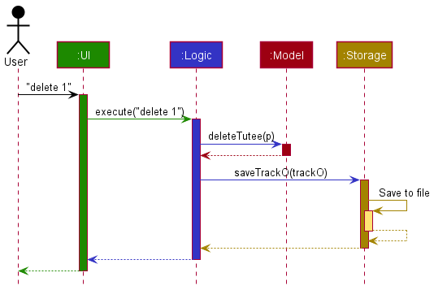

Each of the four main components (also shown in the diagram above),

* defines its *API* in an `interface` with the same name as the Component.
* implements its functionality using a concrete `{Component Name}Manager` class (which follows the corresponding API `interface` mentioned in the previous point.

For example, the `Logic` component defines its API in the `Logic.java` interface and implements its functionality using the `LogicManager.java` class which follows the `Logic` interface. Other components interact with a given component through its interface rather than the concrete class (reason: to prevent outside component's being coupled to the implementation of a component), as illustrated in the (partial) class diagram below.

The sections below give more details of each component.

### UI component

The **API** of this component is specified in [`Ui.java`](https://github.com/AY2122S1-CS2103T-F12-3/tp/blob/master/src/main/java/seedu/address/ui/Ui.java)

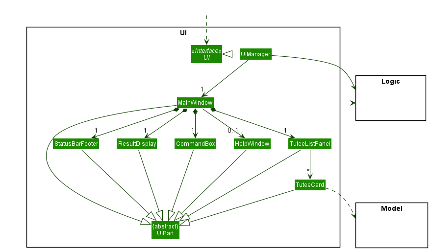

The UI consists of a `MainWindow` that is made up of parts e.g.`CommandBox`, `ResultDisplay`, `TuteeListPanel`, `StatusBarFooter` etc. All these, including the `MainWindow`, inherit from the abstract `UiPart` class which captures the commonalities between classes that represent parts of the visible GUI.

The `UI` component uses the JavaFx UI framework. The layout of these UI parts are defined in matching `.fxml` files that are in the `src/main/resources/view` folder. For example, the layout of the [`MainWindow`](https://github.com/AY2122S1-CS2103T-F12-3/tp/blob/master/src/main/java/seedu/address/ui/MainWindow.java) is specified in [`MainWindow.fxml`](https://github.com/AY2122S1-CS2103T-F12-3/tp/blob/master/src/main/resources/view/MainWindow.fxml)

The `UI` component,

* executes user commands using the `Logic` component.
* listens for changes to `Model` data so that the UI can be updated with the modified data.
* keeps a reference to the `Logic` component, because the `UI` relies on the `Logic` to execute commands.
* depends on some classes in the `Model` component, as it displays `Tutee` object residing in the `Model`.

### Logic component

**API** : [`Logic.java`](https://github.com/AY2122S1-CS2103T-F12-3/tp/blob/master/src/main/java/seedu/address/logic/Logic.java)

Here's a (partial) class diagram of the `Logic` component:

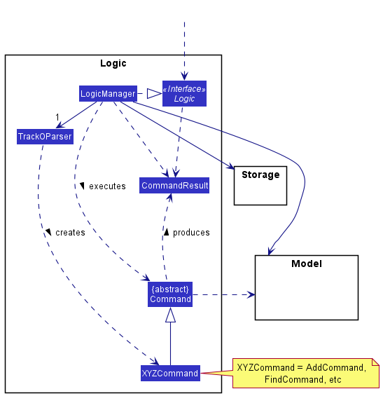

How the `Logic` component works:
1. When `Logic` is called upon to execute a command, it uses the `TrackOParser` class to parse the user command.
1. This results in a `Command` object (more precisely, an object of one of its subclasses e.g., `AddCommand`) which is executed by the `LogicManager`.
1. The command can communicate with the `Model` when it is executed (e.g. to add a tutee).
1. The result of the command execution is encapsulated as a `CommandResult` object which is returned back from `Logic`.

The Sequence Diagram below illustrates the interactions within the `Logic` component for the `execute("delete 1")` API call.

:information_source: **Note:** The lifeline for `DeleteCommandParser` should end at the destroy marker (X) but due to a limitation of PlantUML, the lifeline reaches the end of diagram.

Here are the other classes in `Logic` (omitted from the class diagram above) that are used for parsing a user command:

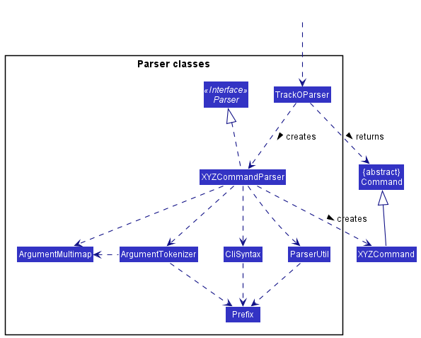

How the parsing works:
* When called upon to parse a user command, the `TrackOParser` class creates an `XYZCommandParser` (`XYZ` is a placeholder for the specific command name e.g., `AddCommandParser`) which uses the other classes shown above to parse the user command and create a `XYZCommand` object (e.g., `AddCommand`) which the `TrackOParser` returns back as a `Command` object.
* All `XYZCommandParser` classes (e.g., `AddCommandParser`, `DeleteCommandParser`, ...) inherit from the `Parser` interface so that they can be treated similarly where possible e.g, during testing.

### Model component
**API** : [`Model.java`](https://github.com/AY2122S1-CS2103T-F12-3/tp/blob/master/src/main/java/seedu/address/model/Model.java)

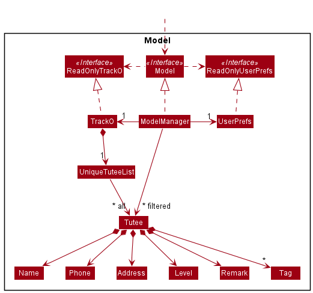

The `Model` component,

* stores the address book data i.e., all `Tutee` objects (which are contained in a `UniqueTuteeList` object).
* stores the currently 'selected' `Tutee` objects (e.g., results of a search query) as a separate _filtered_ list which is exposed to outsiders as an unmodifiable `ObservableList<Tutee>` that can be 'observed' e.g. the UI can be bound to this list so that the UI automatically updates when the data in the list change.
* stores a `UserPref` object that represents the user’s preferences. This is exposed to the outside as a `ReadOnlyUserPref` objects.
* does not depend on any of the other three components (as the `Model` represents data entities of the domain, they should make sense on their own without depending on other components)

:information_source: **Note:** An alternative (arguably, a more OOP) model is given below. It has a `Tag` list in `TrackO`, which `Tutee` references. This allows `TrackO` to only require one `Tag` object per unique tag, instead of each `Tutee` needing their own `Tag` objects. 

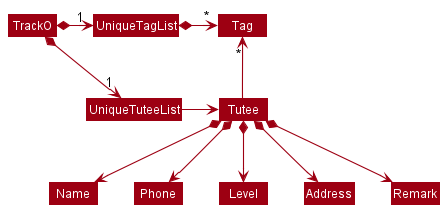

### Storage component

**API** : [`Storage.java`](https://github.com/AY2122S1-CS2103T-F12-3/tp/blob/master/src/main/java/seedu/address/storage/Storage.java)

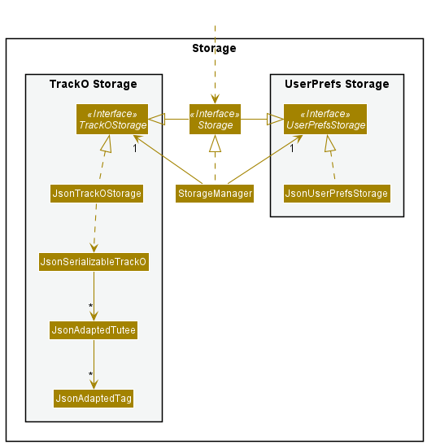

The `Storage` component,
* can save both address book data and user preference data in json format, and read them back into corresponding objects.
* inherits from both `TrackOStorage` and `UserPrefStorage`, which means it can be treated as either one (if only the functionality of only one is needed).
* depends on some classes in the `Model` component (because the `Storage` component's job is to save/retrieve objects that belong to the `Model`)

### Common classes

Classes used by multiple components are in the `seedu.address.commons` package.

--------------------------------------------------------------------------------------------------------------------

## **Implementation**

This section describes some noteworthy details on how certain features are implemented.

### Education Level of tutees

Education level is a compulsory parameter when adding a new tutee. It requires the prefix `l/`,
followed by the abbreviation of the respective education level. Abbreviations can only contain 2 characters:
the first letter of the education level in lowercase, followed by the year of study.

#### Supported Education Levels

* Primary: 1 to 6
* Secondary: 1 to 5
* Junior College: 1 to 2

#### Design considerations
The `value` field of education level in Tutee class is in the abbreviation form.
In `TuteeCard`, the string displayed is `stringRepresentation`,
which is the returned value of the `parse` method in Level class, using `value` as the parameter.
For example, `stringRepresentation` of `p5` is the result of `Level.parse("p5")` which returns `Primary 5`.

Both `value` and `stringRepresentation` are fields belonging to Level.
This is designed for better readability in displaying tutees. Having two fields ensures that the
abbreviation can be obtained using `getLevel()` method in Tutee, instead of parsing the string representation back
to its abbreviated form. In our implementation of `Find`, we use the abbreviations to filter the `tuteelist`. 
`Find` requires the keywords to be exactly equals to the value stored in each `tutee`. Using abbreviations instead of 
the full education level title helps to reduce incorrect find results due to missing spaces or spelling errors.

#### Parse method
The `parse` method splits the string parameter into a charArray and switches case according to the first char.
Due to the regex validation when creating tutee, the first char will be a valid character so no exceptions are thrown here.

### Get feature

#### Rationale

The initial implementation showcases all the information on the tutee card viewer.
However, when more information of a tutee is added, it may clog up the viewer with
less relevant information. The `get` feature hence solves this through only
listing this additional information when necessary.

#### Current Implementation

The current implementation uses indexing to identify
the tutee selected. For instance, `get 2` will list the information
of the second tutee found on the list. The information to be listed is based on the
string representation of a tutee which contains additional information on fields such as `remark` and `lesson`.

#### Design considerations:

**Aspect: How `get` executes:**

* **Current execution** Prints information of tutee to output terminal.
    * Pros: Displays information on output terminal.
    * Cons: May be less aesthetic compared to initial implementation.

### Payment tracking feature

`Payment` keeps track of the payment details of the tutee, such as the amount of fees incurred, the payment due date and the payment history.

#### Rationale

A tutor may miscalculate fees, forget payment due dates, or have too many tutees to keep track of their payment information manually.

#### Current Implementation

The payment tracking feature is facilitated by `Payment`, `PaymentCommandParser`, and respective payment-related commands.

`Payment` contains the following attributes:
* `value`  — the amount of fees incurred by the Tutee since the last payment date
* `payByDate`  — the date which the Tutee has to pay the `value` by
* `paymentHistory`  — a list of dates which the Tutee previously paid on
* `isOverdue` — a boolean flag which denotes if the payment is overdue

Parsing the user's input through `PaymentCommandParser`, the user may execute any one of the following payment-related commands:
* `PaymentCommand`  — Views all the payment details of the specified tutee
* `PaymentAddCommand`  — Adds the cost of the lesson's fees to the tutee's current payment amount due
* `PaymentSetAmountCommand`  — Sets the payment amount due for the tutee to the specified amount
* `PaymentSetDateCommand`  — Sets the pay-by date for the tutee to the specified date
* `PaymentReceiveCommand`  — Resets the tutee's incurred fees and pay-by-date, and updates their payment history

Unlike how `TrackOParser` parses input to return lower-level parsers like `AddCommandParser` which then creates an `AddCommand` only, 
`PaymentCommandParser` parses input to return any one of the payment-related commands as described in the simplified Class diagram below.

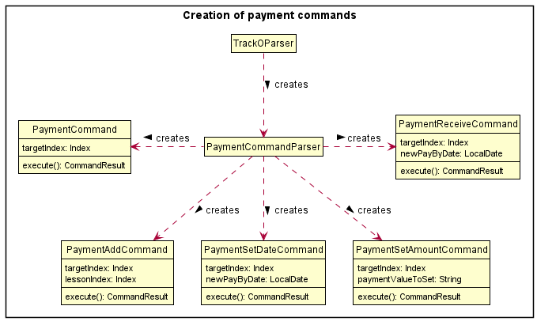

:information_source: **Note:** All the commands in the above diagram inherit from the abstract Command class, but it is omitted from the diagram for simplicity.

The following steps showcase how a tutee's payment details are managed by the user.

Step 1. The user adds a new `Tutee` John to Track-O and the `Payment` object is initialized with default values.

    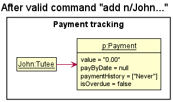

Step 2. After adding lessons to John, the user executes `payment 1 lesson/1`, where John is index `1` in the `Tutee` list, and `lesson1` is index `1` in the `Lesson` list.

    

Step 3. The user executes `payment 1 amount/90` after accidentally overcharging fees previously.

    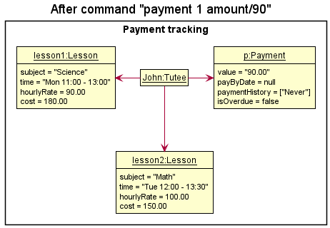

Step 4. The user executes `payment 1 by/01-01-2022`, updating the `Payment#payByDate` for John.

    

Step 5. In the event that the current date passes the `Payment#payByDate`, the `Payment#isOverdue` flag will turn `true`.

    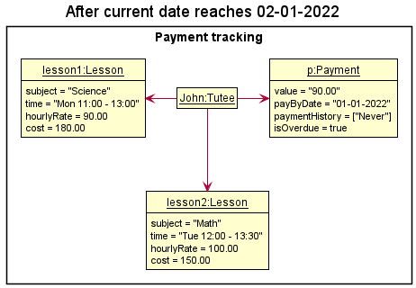

Step 6. The user executes `payment 1 receive/` and receives John's payment, updating the `Payment#paymentHistory` with the current date, and resetting `Payment#payByDate`, and `Payment#value` respectively.

    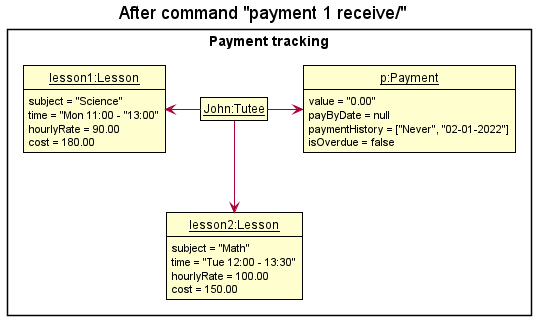

#### Design considerations

**Aspect: How lesson fees are added to payment amounts**

* **Option 1 (current choice):** Add a tutee's lesson's cost to their current payment amount due.
    * Pros: Easy to implement and command would be short.
    * Pros: Would be commonly used to increment tutee's payments directly after a lesson.
    * Cons: Adding multiples of a lesson's cost requires multiple copies of the same command (i.e adding 3 lesson's worth of fees at once).

* **Option 2:** Add a tutee's lesson's cost multiplied by an integer parameter to their current payment amount due
    * Pros: The tutor can easily add multiples of a lesson's cost to a tutee.
    * Cons: The additional integer parameter would require another layer of parsing and validation checking.
    * Cons: Command would be more lengthy as it requires 3 keywords to execute (payment, lesson, integer).

**Aspect: How payment due dates are managed**

* **Option 1 (current choice):** Set a specified payment due date manually for a tutee.
    * Pros: Gives the user the choice to set a payment due date, as not all tutees may require tracking of payments if they pay immediately after a lesson.
    * Cons: Requires more effort for the user to set payment due dates for every tutee, if they require so.

* **Option 2:** Set the payment due date exactly 1 week from the date the tutee last paid.
    * Pros: The tutor need not manually set due dates if the tutees are to pay weekly.
    * Cons: Different tutors collect payments at different times (i.e monthly, biweekly).
    * Cons: Lessons may not occur every week, so the payment due date is subject to manual change quite often, making its automatic nature redundant.

### Lesson management

#### Rationale

A tutor may teach various subjects to various tutees at different times. Hence, it might be difficult to keep track of this information manually. Our lesson management feature aims to provide easy tracking of the lessons taught under each tutee, as well as a quick overview of the tutor’s schedule.

The lesson management feature is facilitated by `Lesson`, `Schedule`, `AddLessonCommand` and `DeleteLessonCommand`.

#### Lesson

##### Current Implementation

`Lesson` contains:
* `subject`  — the subject of the lesson
* `time`  — the time the lesson takes place, which includes the day of week of the lesson, as well as its start time and end time
* `hourlyRate`  — the cost per hour of the lesson
* `cost`  — the total cost of the lesson, derived from the product of the lesson duration and the hourly rate of the lesson

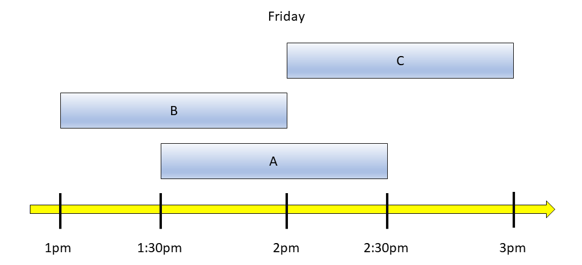

*Figure: `Lesson`s labelled as **A**, **B** and **C** that take place on Friday at different times.*

When comparing between two lessons:
- The two lessons are considered equal when both lessons have the same day of week and they have overlapping time slots. In the figure above, lesson **A** is equal to lesson **B** as they both occur on a Friday and have an overlapping time slot between 1:30pm and 2pm. Similarly, lesson **A** is equal to lesson **C** as they both occur on a Friday and have an overlapping time slot between 2pm and 2:30pm.
- One lesson is considered less than (i.e. before or earlier than) the other lesson when the lesson occurs on a day that is earlier than the other. If both lessons occur on the same day, the lesson that is earlier is the one that has a start time earlier than the other, provided that both lessons do not have overlapping time slots. In the figure above, lesson **B** starts at 1pm while lesson **C** starts at 2pm, and there is no overlapping time slot, hence lesson **B** is earlier than lesson **C**.

#### Schedule

`Schedule` helps to list the weekly lessons of the tutor.

##### Rationale

A tutor may be teaching many lessons to many tutees. It may be difficult to track their upcoming lessons, hence `Schedule` solves these through listing these upcoming lessons.

##### Current Implementation

The `Schedule` class consists of a `TreeMap<Lesson, String>` that stores a mapping of lessons that are sorted by day of occurrence and start time, to the name of the tutee involved in the corresponding lesson.

On the start-up of Track-O, before the tutor inputs any commands, the tutee list is iterated through and each `Lesson` of each tutee, along with their name, is added to the `TreeMap<Lesson, String>` map of lessons.

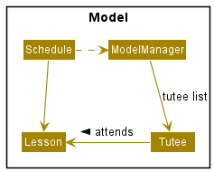

*Figure: Structure of `Schedule`*

The `TreeMap<Lesson, String>` map of lessons will be updated after every execution of commands that modify a tutee's lessons or name.

When adding a lesson to the `Schedule`, the private `Schedule#isClash` method will be invoked on the lesson to check if the lesson is in the `TreeMap<Lesson, String>` map. This is done via the `Lesson#equals` method. If the lesson is in the `TreeMap<Lesson, String>` map, a `ScheduleClashException` will be thrown. This helps to enforce the constraint that the tutor’s schedule should not have any clashes in lesson time.

Consequently, it also means that if the tutor manually adds in lessons to `tracko.json` stored under the `data/` folder such that there are clashes in the tutor's schedule, a `ScheduleClashException` will be thrown on start-up. This exception is handled by wiping out the existing data and starting with an empty tutee list and an empty schedule.

The tutor's schedule can be accessed via the `schedule` command. The sorted lessons will be displayed.

##### Design considerations:

**Aspect: How the schedule is to be stored**

* **Option 1 (current choice):** Retrieves the schedule by iterating through the `TuteeList` on start-up.
    * Pros: Easy to implement.
    * Cons: May have performance issues when the number of tutees and the number of lessons become excessively large.

* **Option 2:** Retrieves the schedule from another JSON file (e.g: `schedule.json`)
    * Pros: The tutor can view their schedule directly on their hard disk without starting up Track-O.
    * Cons: Any changes to the schedule through lesson commands have to be updated in both `tracko.json` and `schedule.json`. If the user manually edits `schedule.json` and not edit `tracko.json`, it is likely to cause issues in processing both JSON files, resulting in the data in both JSON files to be wiped out.

#### AddLessonCommand

`AddLessonCommand` is responsible for creating a `Lesson`, and inserting it into the specified tutee’s list of lessons as well as the tutor’s schedule.

The following activity diagram summarises the steps involved when `AddLessonCommand` is executed.

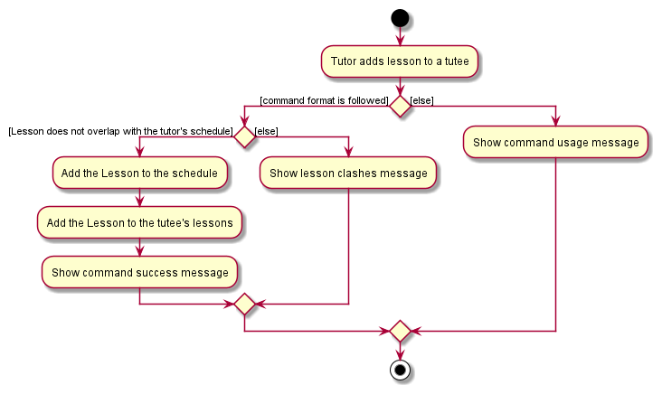

*Figure: Steps involved in adding a lesson*

Let us consider a scenario to illustrate how `AddLessonCommand` works with `Schedule`:

Suppose there exists two `Tutee` objects in the `TuteeList`, named Alice and Bob. Alice currently has a lesson on Friday 3pm to 5pm, while Bob has no lessons. The figure below illustrates this.

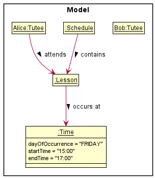

*Figure: Initial object diagram containing Alice, Bob, Alice's lessons and the tutor's schedule*

When the tutor attempts to add a `Lesson` that occurs on Friday 2pm to 4pm, the `Schedule#isClash` method is invoked on the `Lesson` and returns true. This is because the `Lesson` is considered to be equal to Alice’s lesson due to the overlapping time. Thus, a `ScheduleClashException` is thrown and the lesson is not added to Bob. The object diagram remains the same as the figure above.

When the tutor attempts to add a `Lesson` that occurs on Friday 6pm to 7pm, the `Schedule#isClash` method is invoked on the `Lesson` and returns false since there is no overlap in time. The `Lesson` is inserted in the `TreeMap<Lesson, String>` map in `Schedule` after Alice’s lesson, because it is greater than (i.e. after) Alice’s lesson. The updated object diagram is shown below.

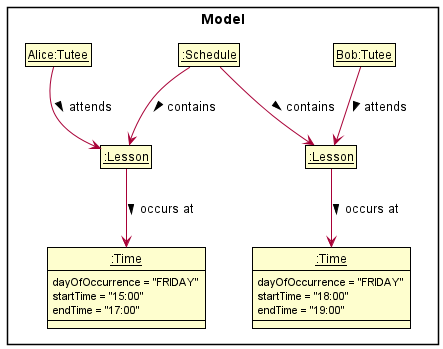

*Figure: Object diagram after `AddLessonCommand` is successfully executed*

#### DeleteLessonCommand

`DeleteLessonCommand` is responsible for removing a lesson that exists in the tutee list as well as a tutee’s lessons.

Suppose Bob has index number of 2 in tutee list and the user wants to delete the 3rd lesson in his list of lessons. 
The following sequence diagram and steps showcase how the `DeleteLessonCommand` would work.

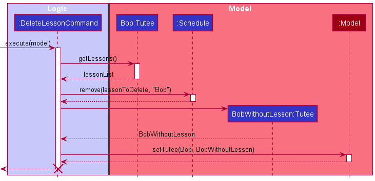 
_Figure: Steps involved in deleting a lesson. Do note that trivial details are omitted e.g getting Bob from tutee list using index 2_

Step 1: The user inputs `deletelesson 2 lesson/3` to remove the lesson. A `DeleteLessonCommand` will be created by 
`LogicManager` and invokes `DeleteLessonCommand#execute`
_Note that the index of lesson "3" is obtained prior to the method call using `get 2` command._

Step 2: `DeleteLessonCommand` retrieves the 3rd lesson in the tutee’s list of lessons. The user’s schedule is accessed and the 
`Schedule#remove` is invoked. This uses the uniqueness property of every element in TreeMap to accurately remove 
**only** the object with key `lessonToDelete` and value `Bob`.

Step 3: When the process is completed, `DeleteLesson` creates a new `BobWithoutLesson` tutee that copies over all the information 
of Bob, except the lesson that was deleted.

Step 4: `BobWithoutLesson` is then used to replace the `Bob` at the original index 2, and model resets the displayed 
list to show the full list of tutee once again.

### Find 
`FindCommand` allows tutors to filter the `tuteelist` according to the keywords supplied. The supported fields for `FindCommand`
includes: `name`, `level`, `subject`, `overdue`.

#### Rationale
Track-O aims to solve problems that arises when he teaches multiple tutees. Tutors may find it difficult to look for a
tutee within the long list. A `find` feature helps to shrink the list down to display only the tutee of interest, giving
them the ability to quickly identify specific tutees and getting information as required.

#### Current implementation
`FindCommandParser` uses `ParserUtil` to get the keywords used in the command.
The keywords are supplied after the prefix when tutors enter the command. Supported prefixes are `n/` `l/` 
`subject/` and `overdue/`.  
`FindCommandParser` then initialises 4 empty string arrays, each represents one of the 4 fields. The keywords
obtained by `ParserUtil` will be added to the respective arrays. If the field does not contain any keywords, the array
for that field remains empty.  
A `CollectivePredicate` object will be created using these arrays of keywords, which serves as our filter test. It
converts each arrays into streams and does an `allmatch` method call, which returns true if the tutee's information 
matches all the keywords of that field. However, if the keyword stream is empty, the returned result will also be
`true`. To address this issue, we used an `activeTests` array and only add the result of `allmatch` to the array 
if the stream contains keywords. `CollectivePredicate#test` finally returns true if `activeTests` is a non-zero length
array and all the booleans are `true`.  
The following activity diagram shows an example of the flow of`CollectivePredicate#test`
executed on a `Tutee` Bob.

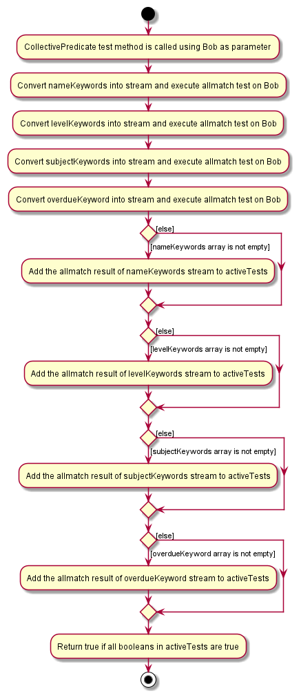

The following sequence diagram shows the workflow when a user uses the `Find` feature.
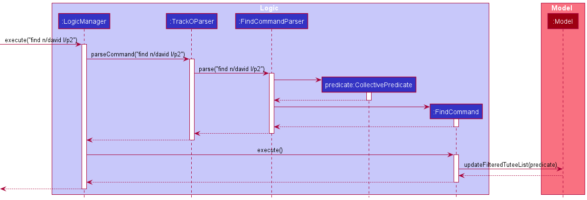

#### Design Considerations
We had 2 design ideas of the `find` command:
1. Allow `FindCommand` to search with multiple keywords, and return tutees that fulfills **either** keywords
2. Allow `FindCommand` to search with multiple keywords, and return tutees that fulfills **all** keywords

We decided on the 2nd implementation due to these reasons:
* Everytime a new keyword is supplied, the returned `tuteelist` will be equals to or smaller than without the new keyword,
as opposed to design 1, where the `tuteelist` is equals to or longer than the without the keyword. 
* We want the find feature to address the issue of `tuteelist` being too cluttered when number of tutees increases, so
design 2 fits our requirement better.
* It enables tutors to find a specific tutee by adding additional keywords if many tutees share the same name.

--------------------------------------------------------------------------------------------------------------------

## **Documentation, logging, testing, configuration, dev-ops**

* [Documentation guide](Documentation.md)
* [Testing guide](Testing.md)
* [Logging guide](Logging.md)
* [Configuration guide](Configuration.md)
* [DevOps guide](DevOps.md)

--------------------------------------------------------------------------------------------------------------------

## **Appendix: Requirements**

### Product scope

**Target user profile**:

Private tutors who have many tutees of different educational levels, teaching different subjects.

**Value proposition**:

The product manages the information of tutees on a collated digital platform, as opposed to storing it physically. Information specific to the progress of individual students can be tracked.

Tutors will have an overview of each individual tutee’s progress. As such, they would not have to manually keep track of all the information, which could lead to errors and be difficult to maintain.

The platform is personalized for private tutors as opposed to other audiences (like tuition centres) as the app tracks the progress of individual tutees more closely and allows for automatic calculation of tuition fees.

### User stories

| Priority | As a …​                                    | I want to …​                   | So that I can…​                                                        |
| -------- | ------------------------------------------ | ------------------------------ | ---------------------------------------------------------------------- |
| `* * *`  | first-time user                            | view all the commands I need to learn  | start using the app right away. |
| `* * *`  | private tutor with many students           | list out my tutee's information in an overview | plan my lessons effectively. |
| `* * *`  | private tutor                              | add information about my tutees easily | keep track of their progress. |
| `* * *`  | private tutor with many students           | find information of one specific student through his name. | |
| `* * *`  | recently fired tutor                       | delete all the data of a particular student. | |
| `* * *`  | tutor with many existing tuition classes   | add a class that does not clash with existing classes   | plan my time more effectively. |
| `* * *`  | forgetful tutor                            | know where my tutee stays | find my way to the correct location. |
| `* * *`  | private tutor who teaches tutees of various subjects and at various levels | tag the tutees by level and/or subject (e.g: P5 Math) | search for all tutees related to the level/subject easily. |
| `* * *`  | private tutor                              | delete all data at one go (maybe with reconfirmation before clearing everything) | start afresh. |
| `* *`    | careless user                              | edit each portion easily | minimize mistakes in storing data. |
| `* *`    | careless user                              | know what I typed wrongly when I enter a wrong command. | |
| `* *`    | organized tutor                            | know which students I will be teaching later | prepare materials accordingly. |
| `* *`    | disorganized tutor                         | see my schedule for the week | plan for unconfirmed tuition time slots. |
| `* *`    | forgetful tutor                            | see the status of each student’s payment beforehand | remind them about payment collection during the class. |
| `* *`    | private tutor                              | add and delete lessons for my tutee | cater for last minute changes to plans |
| `* *`    | disorganized tutor                         | keep track of the (contact numbers of) students that have not paid for this month’s payment | contact them to pay up. |
| `*`      | first-time user                            | experiment with the basic commands with sample data | familiarise myself with the commands in a safe space. |
| `*`      | first-time user                            | clear all sample data | start adding in my own data. |
| `*`      | forgetful tutor                            | know what's the current upcoming tuition session | plan for it. |
| `*`      | private tutor with an increasing number of students | sort my students by specific fields, such as lesson date or level and school of student. | so that I can find them easily |

### Use cases

(For all use cases below, the **System** is `Track-o` and the **Actor** is the `user`, unless specified otherwise)

#### UC01: Seek help on the usage of commands

**MSS**
1. User requests for help regarding how to use the commands.
2. System provides the usage of commands.

   Use case ends.

 

#### UC02: Add a tutee

**MSS**
1. User requests to add a tutee by providing the details of the tutee.
2. System adds the tutee.

   Use case ends.

**Extensions**
* 1a. Some compulsory details of the tutee are not included.
    * 1a1. System shows an error message.

      Use case resumes at step 1.

 

#### UC03: View all tutees

**MSS**
1. User requests to view all tutees.
2. System shows a list of tutees.

   Use case ends.

 

#### UC04: Delete a tutee

**MSS**
1. User requests to list tutees.
2. System shows a list of tutees.
3. User requests to delete a specific tutee in the displayed tutee list.
4. System deletes the tutee.

   Use case ends.

**Extensions**

* 3a. The given tutee list index is invalid.
    * 3a1. System shows an error message.

      Use case resumes at step 2.

 

#### UC05: View a specific tutee

**MSS**
1. User requests to list tutees.
2. System shows a list of tutees.
3. User requests to view a specific tutee in the displayed tutee list.
4. System shows that specific tutee.

   Use case ends.

**Extensions**

* 3a. The given tutee list index is invalid.
    * 3a1. System shows an error message.

      Use case resumes at step 2.

 

#### UC06: Search for tutees by their name, level and/or subject

**MSS**
1. User requests to search for tutees by their name, level and/or subject.
2. System shows a list of tutees matching the name, level and/or subject.

   Use case ends.

 

#### UC07: Edit a specific tutee

**MSS**
1. User requests to list tutees.
2. System shows a list of tutees.
3. User requests to edit a specific tutee in the displayed tutee list.
4. System edits that specific tutee.

   Use case ends.

**Extensions**

* 3a. The given tutee list index is invalid.
    * 3a1. System shows an error message.

      Use case resumes at step 2.

* 3b. No details to be edited to the tutee are provided.
    * 3b1. System shows an error message.

      Use case resumes at step 2.

 

#### UC08: View the schedule for the week

**MSS**
1. User requests to view his/her schedule for the week.
2. System shows the schedule.

   Use case ends.

 

#### UC09: Add a lesson to a specific tutee

**MSS**
1. User requests to list tutees.
2. System shows a list of tutees.
3. User requests to add a lesson to a specific tutee in the displayed tutee list.
4. System adds a lesson to that specific tutee.

   Use case ends.

**Extensions**

* 3a. The given tutee list index is invalid.
    * 3a1. System shows an error message.

      Use case resumes at step 2.

* 3b. Details of the lesson are not fully provided.
    * 3b1. System shows an error message.

      Use case resumes at step 2.
    
 

#### UC10: Delete a specific lesson from a specific tutee

**MSS**
1. User requests to list tutees.
2. System shows a list of tutees.
3. User requests to delete a specific lesson from a specific tutee in the displayed tutee list.
4. System deletes that specific lesson from that specific tutee.

   Use case ends.

**Extensions**

* 3a. The given tutee list index is invalid.
    * 3a1. System shows an error message.

      Use case resumes at step 2.

* 3b. The given lesson index of that specific tutee is invalid.
    * 3b1. System shows an error message.

      Use case resumes at step 2.

 

#### UC11: View existing payment details of a tutee

**MSS**
1. User requests to list tutees.
2. System shows a list of tutees.
3. User requests to view payment details of a specific tutee in the displayed tutee list.

   Use case ends.

   **Extensions**

* 3a. The given tutee list index is invalid.
    * 3a1. System shows an error message.

      Use case resumes at step 2.

 

#### UC12: Add lesson fees to payment owed by tutee

**MSS**
1. User requests to <ins>[view payment details of a tutee (UC11)](#uc11-view-existing-payment-details-of-a-tutee)</ins>
2. User requests to add the fees of a specific lesson to the existing fees.
3. System shows new updated payment details.

   Use case ends.

   **Extensions**

* 2a. The given lesson index is invalid.
    * 2a1. System shows an error message.

      Use case resumes at step 2.
    
 

#### UC13: Manually update payment fees owed by tutee

**MSS**
1. User requests to <ins>[view payment details of a tutee (UC11)](#uc11-view-existing-payment-details-of-a-tutee)</ins>
2. User requests to update fees to new desired amount.
3. System shows new updated payment details.

   Use case ends.

   **Extensions**

* 2a. The given amount is invalid.
    * 2a1. System shows an error message.

      Use case resumes at step 2.

 

#### UC14: Receive payment fees owed by tutee

**MSS**
1. User requests to <ins>[view payment details of a tutee (UC11)](#uc11-view-existing-payment-details-of-a-tutee)</ins>
2. User requests to set fees of tutee as received.
3. System shows new updated payment details.

   Use case ends.

   **Extensions**

* 2a. Date is provided.
    * 2a1. System updates and shows the new date to make payment by.

      Use case resumes at step 3.

* 2b. Date is not provided.
    * 2b1. System updates and removes the date to make payment by.

      Use case resumes at step 3.
    
 

#### UC15: Find tutees with overdue payment

**MSS**
1. User requests to find tutees with overdue payment.
2. System shows list of tutees that are overdue.

   Use case ends.

 

#### UC16: Clear all data

**MSS**
1. User requests to clear all data.
2. System clears all data.

   Use case ends.

### Non-Functional Requirements

1. Should work on any _mainstream OS_ as long as it has Java `11` or above installed.
2. Should be able to hold up to 1000 tutees without a noticeable sluggishness in performance for typical usage.
3. A user with above average typing speed for regular English text (i.e. not code, not system admin commands) should be able to accomplish most of the tasks faster using commands than using the mouse.
4. The data should not be made accessible to anyone else other than the user.
5. The system should be usable by a user who has never used a task manager, schedule tracker, or other forms of similar applications.

### Glossary

* **Mainstream OS**: Windows, Linux, Unix, OS-X
* **Education level**: Education level of an individual in the context of Singapore. Supported education levels are contextualized to the primary, secondary and JC level. For instance, `P5` refers to Primary 5, `JC2` refers to Junior College Year 2
* **Database**: Storage on local system

--------------------------------------------------------------------------------------------------------------------

## **Appendix: Instructions for manual testing**

Given below are instructions to test the app manually.

:information_source: **Note:** These instructions only provide a starting point for testers to work on;
testers are expected to do more *exploratory* testing. Additionally, test cases are not continuous and prerequisites must be met for each test case.

We recommend you copy the command required for adding a new tutee as it will be used in every test case.
A valid `add` command is provided below: 
`add n/John Tan l/p5 a/246 Hougang Ave sch/Rosyth School p/84567890`

### Launch and shutdown

Initial launch

1. Download the jar file and copy into an empty folder

2. Double-click the jar file Expected: Shows the GUI with a set of sample contacts. The window size may not be optimum.

Saving window preferences

1. Resize the window to an optimum size. Move the window to a different location. Close the window.

2. Re-launch the app by double-clicking the jar file. 
   Expected: The most recent window size and location is retained.

### Getting a tutee's information

Getting a tutee's information

1. Prerequisites:
   1. Clear tutee list with `clear` command. 
   2. Add a new tutee with the `add` command.
2. Test case: get 1
Expected: First tutee's information is retrieved. The tutee's details are shown in the result panel.
3. Test case: get 0
   Expected: No tutee's information is retrieved. Error details shown in the status message.
4. Other incorrect `get` commands to try: `get`, `get x` (where x is larger than the list size)  Expected: Similar to previous.

### Adding a lesson to a tutee

1. Prerequisites:
    1. Clear tutee list with clear command.
    2. Add a new tutee with the add command.

2. Test case: addlesson 1 subject/Biology d/7 s/11:30 e/13:30 rate/40.50 
   Expected: Details of the tutee's new lesson is shown in the status message.
3. Test case: addlesson 0 subject/Biology d/7 s/11:30 e/13:30 rate/40.50 
   Expected: No lesson is added. Error details shown in the status message.
4. Other incorrect `addlesson` commands to try: `addlesson 1 subject/Biology d/99 s/11:30 e/13:30 rate/40.50`, `addlesson 1 subject/Biology d/7 s/55:30 e/13:30 rate/40.50`, `addlesson x subject/Biology d/7 s/11:30 e/13:30 rate/40.50` (where x is larger than the list size) Expected: Similar to previous.

###  Finding a tutee

1. Test case: find n/David 
    Expected: All tutees with name containing the word “David” will be displayed. The tutee list should only show the matched tutee.
2. Test case: Test case: find n/David Lee 
    Expected: All tutees with name containing both “David” and “Lee” will be displayed. The tutee list should only show matched tutee.
3. Test case: Test case: find n/David subject/math 
    Expected: All tutees with name containing “David” and has a lesson with subject name “math” will be displayed. The tutee list should only show matched tutee.
4. Test case: find name/David
    Expected: Error details shown in the results panel.
5. Other incorrect find commands to try: find n/, find n/C@@l, find l/primary 5.
    Expected: Similar to previous.

### Adding lesson fees to payment amount

Adding lesson fees a tutee's payment amount

1. Prerequisites: 
   1. Clear tutee list with `clear` command. 
   2. Add a new tutee with the `add` command.
   3. Add one lesson with the `addlesson` commmand.

2. Test case: `payment 1 lesson/1` 
   Expected: Tutee's payment amount is changed to the lesson's total cost, the hourly rate multiplied by the duration in hours. Details of the tutee's new payment details are shown in the status message.
3. Test case: `payment 1 lesson/` 
   Expected: Tutee's payment details are not changed. Error details shown in the status message.
4. Other incorrect `payment...lesson` commands to try: `payment 1 lesson/a`, `payment 1 lesson/-30` 
   Expected: Similar to previous.

### Deleting a lesson from a tutee

1. Prerequisites:
    1. Clear tutee list with clear command.
    2. Add a new tutee with the add command.
    3. Add a new lesson to the tutee with the following command: addlesson 1 subject/Biology d/7 s/11:30 e/13:30 rate/40.50.

2. Test case: deletelesson 1 lesson/1 
   Expected: The first lesson of the first tutee in the tutee list is deleted.
3. Test case: deletelesson 0 lesson/1 
   Expected: No lesson is deleted. Error details shown in the status message.
4. Other incorrect deletelesson commands to try: deletelesson 1 lesson/0, deletelesson x lesson/1, ... (where x is larger than the tutee list size)
    Expected: Similar to previous.

### Setting payment due dates for a tutee

Setting tutee's payment due date to 1st January 2022.

1. Prerequisites:
    1. Clear tutee list with `clear` command.
    2. Add a new tutee with the `add` command.

2. Test case: `payment 1 by/01-01-2022` 
   Expected: Tutee's payment due date is changed to the 1st January 2022. Details of the tutee's new payment details are shown in the status message.
3. Test case: `payment 1 by/` 
   Expected: Tutee's payment due date is not changed. Error details shown in the status message.
4. Other incorrect `payment...by` commands to try: `payment 1 by/a`, `payment 1 by/05-11-2021`, `payment 1 by/5-Nov-2021` 
   Expected: Similar to previous.

### Editing payment amount

Manually editing a tutee's payment amount

1. Prerequisites: 
   1. Clear tutee list with `clear` command.
   2. Add a new tutee with the `add` command.
2. Test case: `payment 1 amount/50` 
   Expected: Tutee's payment details are changed to `$50.00`. Details of the tutee's new payment details are shown in the status message.
3. Test case: `payment 1 amount/` 
   Expected: Tutee's payment details are not changed. Error details shown in the status message.
4. Other incorrect `payment...amount`commands to try: `payment 1 amount/a`, `payment 1 amount/-30`, `payment 1 amount/500000`, `payment 1 amount/30.12` 
Expected: Similar to previous.

### Receiving payments from a tutee

Receiving a payment from a tutee after collecting their payments.

1. Prerequisites:
    1. Clear tutee list with `clear` command.
    2. Add a new tutee with the `add` command.
    3. Add a payment due date for the tutee with the `payment ... by/` command.
    4. Set a payment amount for the tutee with the `payment ... amount/` command. (Optional)

2. Test case: `payment 1 receive/` 
   Expected: Tutee's payment amount is reset to 0 and the payment due date is reset. Their last paid date is set to today's date. Details of the tutee's new payment details are shown in the status message.
3. Test case: `payment 1 receive/01-01-2022` 
   Expected: Tutee's payment amount is reset to 0 and the payment due date is set to 1st January 2022. Their last paid date is set to today's date. Details of the tutee's new payment details are shown in the status message.
5. Test case: `payment 1 receive/1-1-2022` 
   Expected: Tutee's payment due date is not changed. Error details shown in the status message.
6. Other incorrect `payment...receive` commands to try: `payment 1 receive/a`, `payment 1 receive/124123` 
   Expected: Similar to previous.

### Adding a remark to a tutee

Adding a remark to a tutee with no remarks
1. Prerequisites:
    1. Clear tutee list with `clear` command.
    2. Add a new tutee with the `add` command.
    3. The tutee's remark field is blank (-).
2. Test case: remark 1 r/test
   Expected: First tutee's remarks are modified. The tutee's remarks are shown in the result panel under "Remarks:".
3. Test case: remark 1 r/
   Expected: First tutee's remarks are modified. The tutee's remarks are shown in the results panel under "Remarks:". The application allows for blank remarks as line breaks.
4. Test case remark 0 r/
   Expected: First tutee's remarks are not modified. Error details shown in the status message.
5. Other incorrect remark commands to try: remark, remark 1, remark x r/, ... (where x is larger than the list size)
   Expected: Similar to previous.
Adding a remark to a tutee with existing remarks
1. Prerequisites: 
   1. Clear tutee list with `clear` command.
   2. Add a new tutee with the `add` command.
   3. The tutee's remark field already has user input with the `remark` command.
2. Test case: `remark 1 r/test` 
   Expected: First tutee's remarks are modified. The tutee's remarks are appended to existing remarks in the result panel under "Remarks:" .
3. Test case: `remark 1 r/` 
   Expected: First tutee's remarks are modified. The tutee's remarks are appended to existing remarks in the results panel under "Remarks:". The application allows for blank remarks as line breaks.
4. Test case `remark 0 r/` 
   Expected: No remarks are modified. Error details shown in the status message.
5. Other incorrect remark commands to try: `remark`, `remark 1`, `remark x r/` (where x is larger than the list size)
     Expected: Similar to previous.

### Clearing a remark from a tutee

Clearing a remark from a tutee with no remarks
1. Prerequisites:
   1. Clear tutee list with `clear` command.
   2. Add a new tutee with the `add` command.
   3. The tutee's remark field is blank (-).
2. Test case: `clearremark 1`
        Expected: There are no changes to the tutee's remarks as there are no remarks to clear. Error details shown in the status message.
3. Test case `clearremark 0`
        Expected: No remarks are cleared. Error details shown in the status message.

Clearing a remark from a tutee with existing remarks
1. Prerequisites:
   1. Clear tutee list with `clear` command.
   2. Add a new tutee with the `add` command.
   3. The tutee's remark field already has user input.
2. Test case: `clearremark 1`
        Expected: First tutee's remarks are cleared. The tutee's remarks should show as "Remarks: -" in the results panel.
3. Test case: `clearremark 0`
    Expected: No remarks are cleared. Error details shown in the status message.
4. Other incorrect remark commands to try: `clearremark`, `clearremark x` (where x is larger than the list size)
        Expected: Similar to previous.

### Saving data

Dealing with missing/corrupted data files

1. Application will launch with an empty file
2. Update the file as necessary to include the relevant tutee information.

