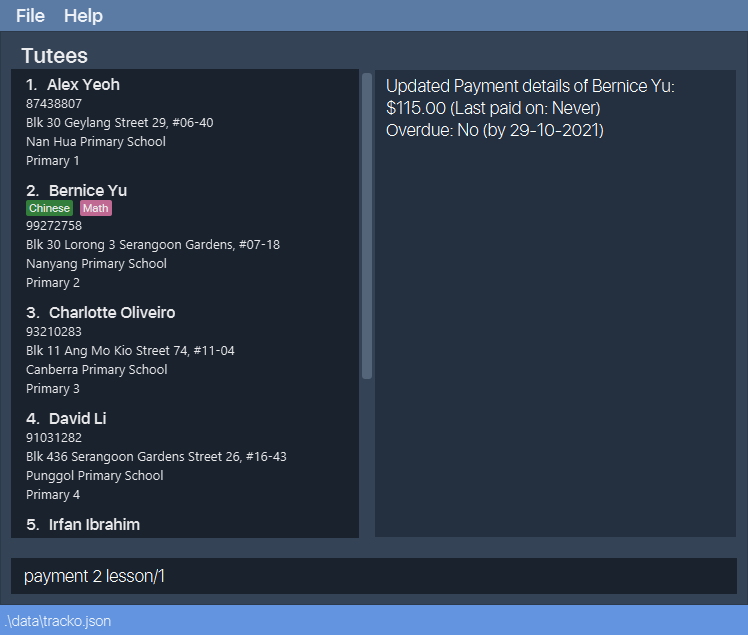
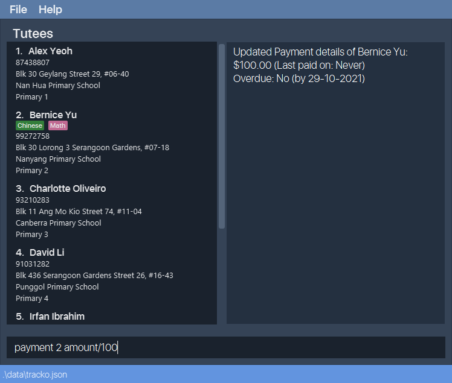
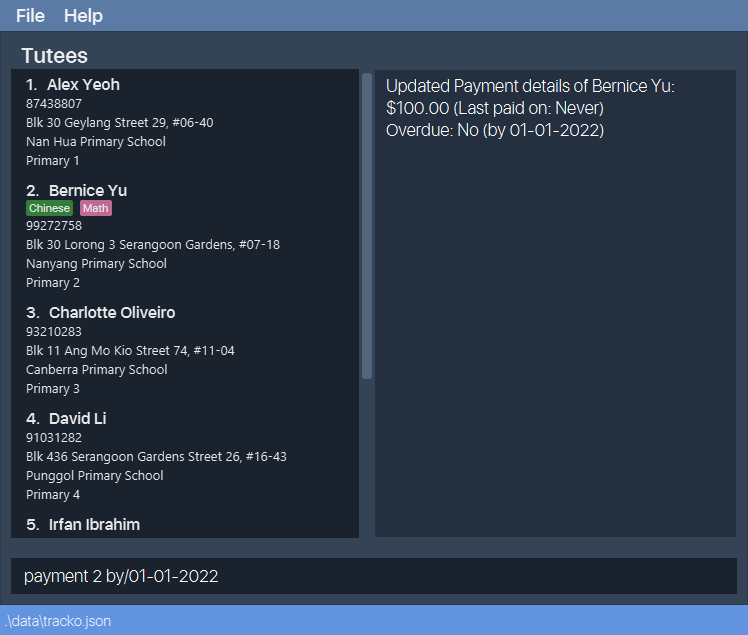
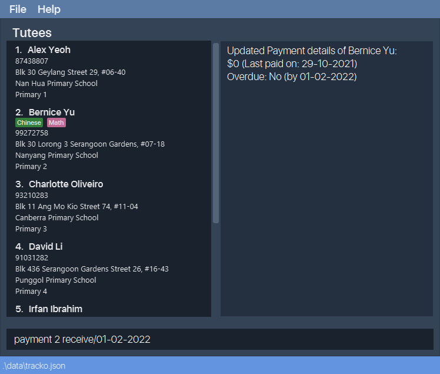

Track-O is a **desktop app for private tutors to manage their tutees**, optimized for use via a Command Line Interface (CLI) while still having the benefits of a Graphical User Interface (GUI). Track-O lets you track an assortment of data, from grades to home addresses to lesson timings. You can easily access the many functions of Track-O using simple commands, such as add and get. Hop over to our Quick Start section to get started.

* Table of Contents
{:toc}

--------------------------------------------------------------------------------------------------------------------

## Quick start

1. Ensure you have Java `11` or above installed in your Computer. 

2. Download the latest `tracko.jar` from [here](https://github.com/AY2122S1-CS2103T-F12-3/tp/releases/download/v1.3.1/v1.3.1.jar).

3. Copy the file to the folder you want to use as the _home folder_ to run Track-O.

4. Double-click the file to start the app. The GUI similar to the below should appear in a few seconds. Note how the app contains some sample data. 

5. Type the command in the command box and press Enter to execute it. e.g. typing **`help`** and pressing Enter will prompt the help window. 
   Some example commands you can try:

   * **`add`**`n/John Doe p/93456789 sch/Temasek Jc l/j2 a/135 Rivervale Link` : Adds a tutee named John Doe with all his relevant information in the tutee list.

   * **`list`** : Lists all tutees.

   * **`delete`**`3` : Deletes the 3rd tutee shown in the tutee list.

   * **`clear`** : Deletes all tutees in the tutee list.

   * **`exit`** : Exits the app.

6. Refer to the [Features](#features) below for details of each command.

--------------------------------------------------------------------------------------------------------------------

## Features

* Words in `UPPER_CASE` are the parameters to be supplied by the user. 
  e.g. in `add n/NAME`, `NAME` is a parameter which can be used as `add n/John Doe`.

* Items in square brackets are optional. 
  e.g `n/NAME [t/TAG]` can be used as `n/John Doe t/friend` or as `n/John Doe`.

* Items with `…` after them can be used multiple times. 
e.g. `[t/TAG]…` tags are optional can be added multiple times: `t/friend`, `t/friend t/family` etc. 
e.g. `[subject/SUBJECT…]` subject keywords are optional and allows multiple keyword search: `subject/English Math Science`
* Parameters can be in any order. 
  e.g. if the command specifies `n/NAME p/PHONE_NUMBER`, `p/PHONE_NUMBER n/NAME` is also acceptable.

* If a parameter is expected only once in the command but you specified it multiple times, only the last occurrence of the parameter will be taken. 
  e.g. if you specify `p/12341234 p/56785678`, only `p/56785678` will be taken.

* Extraneous parameters for commands that do not take in parameters (such as `help`, `list`, `schedule`, `exit` and `clear`) will be ignored. 
  e.g. if the command specifies `help 123`, it will be interpreted as `help`.

### Viewing help : `help`

Shows a message explaining how to access the help page.

Format: `help`

### Adding a tutee: `add`

Adds a tutee to the existing list of tutees.

Format: `add n/NAME p/PHONE sch/SCHOOL l/LEVEL a/ADDRESS [t/TAG]…`

Examples:
* `add n/John Doe p/93456789 sch/Temasek Jc l/j2 a/135 Rivervale Link`
* `add n/Betsy Crowe l/p5 a/246 Hougang Ave 6 sch/Rosyth p/84567890 t/North-east region`

### Editing a tutee :  `edit`

Edits an existing tutee in the tutee list.

Format: `edit INDEX [n/NAME] [p/PHONE] [sch/SCHOOL] [l/LEVEL] [a/ADDRESS] [t/TAG]…`

* Edits the person at the specified `INDEX`. 
* The index refers to the index number shown in the displayed tutee list and **must be a positive integer** 1, 2, 3, …
* At least one of the optional fields must be provided.
* Existing values will be updated to the input values.
* When editing tags, the existing tags of the tutee will be removed i.e adding of tags is not cumulative.
* You can remove all the tutee’s tags by typing `t/` without specifying any tags after it.

Examples:
* `edit 1 p/91234567 a/345 Bedok North Ave 3` Edits the phone number and address of the 1st tutee to be `91234567` and `345 Bedok North Ave 3` respectively.
* `edit 2 n/Betty Chan t/` Edits the name of the 2nd tutee to be `Betty Chan` and clears all existing tags.

### Deleting a tutee : `delete`

Deletes the specified tutee from our list of tutees.

Format: `delete INDEX`

* Deletes the tutee at the specified `INDEX`.
* The index refers to the index number tagged to each tutee in the tutee list.
* The index must be within the size of the tutee list and **must be a positive integer** 1, 2, 3, …

Examples:
* `list` followed by `delete 2` deletes the 2nd tutee in the address book.

### Listing all tutees : `list`

Shows the current list of tutees.

Format: `list`

### Viewing a tutee : `get`

Gets details of the specified tutee from our list of tutees.

Format: `get INDEX`

* Gets the tutee at the specified `INDEX` in the format `Name: John Doe Level: P5`
* The index refers to the index number tagged to each tutee in the tutee list.
* The index must be within the size of the tutee list and **must be a positive integer** 1, 2, 3, …

Examples:
* `list` followed by `get 2` shows the 2nd tutee in the address book.

### Finding tutee by fields : `find`

Filters the tutee list to display matches according to keywords.

Format: `find [n/NAME…] [subject/SUBJECT…] [l/LEVEL] [overdue/OVERDUE_STATUS]`

* A valid `find` command must have at least 1 of the 4 filters.
* Keywords are case-insensitive.
* The returned tutee list contains matches that fulfills all the keywords.
* `name` filter can take **multiple keywords** to be matched and can only be alphanumeric characters.
* `subject` filter can take **multiple keywords** to be matched and can only be alphanumeric characters.
* `level` filter can only take **1 keyword** in the form of abbreviation. 
  e.g. `p5` for Primary 5, `s2` for Secondary 2
* `overdue` filter can only take **1 keyword**, either `yes` or `no`.

Example:
* Find all `David` in the tutee list: `find n/david`.
* Find `David Lee` in the tutee list: `find n/david lee`.
* Find all `Secondary 4` tutees: `find l/s4`.
* Find all tutees taking `math` classes with fees overdue: `find subject/math overdue/yes`.

### Clearing all entries : `clear`

Clears the tutee list and the user's schedule.

Format: `clear`

### Adding a remark to a tutee: `remark`

Adds a remark to the specified tutee with the provided `TEXT` input. New remarks will be appended to existing ones and will not overwrite them.

Format: `remark INDEX r/TEXT`

* Adds the desired `TEXT` to the tutee specified at the specified `INDEX`.
* The index refers to the index number tagged to each tutee in the tutee list.
* The index must be within the size of the tutee list and **must be a positive integer** 1, 2, 3, …

Examples:
* `remark 1 r/Went through Organic Chemistry`

### Clearing all remarks of a tutee: `clearremark`

Clears all remarks of the specified tutee.

Format: `clearremark INDEX`

* Clears all remarks of the tutee specified at the specified `INDEX`.
* The index refers to the index number tagged to each tutee in the tutee list.
* The index must be within the size of the tutee list and **must be a positive integer** 1, 2, 3, …

Examples:
* `clearremark 1`

### Adding a lesson to a tutee : `addlesson`

Adds a lesson to the specified tutee from our list of tutees and to the user's schedule.

Format: `addlesson INDEX subject/SUBJECT d/DAY_OF_WEEK s/START_TIME e/END_TIME rate/HOURLY_RATE`

* Adds a lesson to the tutee at the specified `INDEX`.
* The index refers to the index number tagged to each tutee in the tutee list.
* The index must be within the size of the tutee list and **must be a positive integer** 1, 2, 3, …
* The lesson occurs on the specified `DAY_OF_WEEK`, from the specified `START_TIME` to the specified `END_TIME`, costing `HOURLY_RATE` dollars per hour.
* `DAY_OF_WEEK` **must be an integer in the range [1, 7]** where `1` to `7` corresponds to Monday to Sunday.
* `START_TIME` and `END_TIME` must be specified in an `HH:MM` format.
* `HOURLY_RATE` **must be a positive number** expressed in either zero decimal places or two decimal places with the last decimal place (i.e. last digit) being `0` or `5`.

Examples:
* `addlesson 1 subject/Biology d/4 s/11:30 e/13:30 rate/40.50`
* `addlesson 2 subject/Math d/5 s/19:30 e/21:30 rate/40.75`
* `addlesson 3 subject/Chemistry d/7 s/08:30 e/09:45 rate/40`

### Deleting a lesson to a tutee : `deletelesson`

Deletes an existing lesson from the specific tutee's lesson list and user's schedule.

Format: `deletelesson TUTEE_INDEX lesson/LESSON_INDEX`

* The tutee's index is the number displayed beside tutee's name in the filtered tutee's list.
* The lesson index is the number displayed beside the subject name after using `get` command on the tutee.
* `TUTEE_INDEX` and `LESSON_INDEX` are compulsory fields, an error message is produced if either one is missing.

Examples:
* Deleting **lesson 2** from **tutee 3**:
  `deletelesson 3 lesson/2`
* Deleting **lesson 3** from **tutee 1**:
  `deletelesson 1 lesson/3`

### Tracking lesson schedule : `schedule`

Retrieves the user's schedule of lessons.

Format: `schedule`

### Tracking tutee payments : `payment`

Retrieves tutee payment details and access to other payment-related commands

#### To retrieve a specified tutee's payment details:

Format: `payment INDEX`

* Retrieves the payment details of the tutee at the specified `INDEX`.
* `INDEX` refers to the index number tagged to each tutee in the tutee list.
* `INDEX` must be within the size of the tutee list and **must be a positive integer** 1, 2, 3, …

Examples:
* `payment 1`

#### To add a specified lesson's fees to a specified tutee:

Format: `payment INDEX lesson/LESSON_INDEX`

* Adds the fees of the specified lesson at `LESSON_INDEX` to the specified tutee's payment details at `INDEX`.
* `INDEX` refers to the index number tagged to each tutee in the tutee list.
* `INDEX` must be within the size of the tutee list and **must be a positive integer** 1, 2, 3, …
* `LESSON_INDEX` must be within the size of the tutee's lesson list and **must be a positive integer** 1, 2, 3, …

Examples:
* `payment 1 lesson/1`
* `payment 1 lesson/2`

#### To edit a specified tutee's payment amount:

Format: `payment INDEX amount/AMOUNT`

* Changes the payment amount due by the specified tutee at `INDEX` to `AMOUNT`.
* `INDEX` refers to the index number tagged to each tutee in the tutee list.
* `INDEX` must be within the size of the tutee list and **must be a positive integer** 1, 2, 3, …
* `AMOUNT` **must be greater than or equal to 0** expressed in either zero decimal places or two decimal places with the last decimal place (i.e. last digit) being `0` or `5`.

Examples:
* `payment 1 amount/0`
* `payment 1 amount/80.50`
* `payment 2 amount/100`

#### To set a specified tutee's payment due date:

Format: `payment INDEX by/DUE_DATE`

* Changes the payment due date of the specified tutee at `INDEX` to `DUE_DATE`.
* `INDEX` refers to the index number tagged to each tutee in the tutee list.
* `INDEX` must be within the size of the tutee list and **must be a positive integer** 1, 2, 3, …
* `DUE_DATE` **must be later than or on the current date** expressed in the `dd-MM-YYYY` format.

Examples:
* `payment 1 by/25-12-2021`
* `payment 2 by/01-01-2022`

#### To receive a tutee's payment (and set a next payment due date):

Format: `payment INDEX receive/[DUE_DATE]`

* Resets the payment amount due of the specified tutee to `0`.
* Resets the payment due date of the specified tutee at `INDEX` to `-`, or `DUE_DATE` if specified.
* Updates the specified tutee's last paid date in their payment details to the current date.
* `INDEX` refers to the index number tagged to each tutee in the tutee list.
* `INDEX` must be within the size of the tutee list and **must be a positive integer** 1, 2, 3, …
* `DUE_DATE` **must be later than or on the current date** expressed in the `dd-MM-YYYY` format, if specified.

Examples:
* `payment 1 receive/`
* `payment 2 receive/01-01-2022`

### Exiting application : `exit`

Exits from the application.

Format: `exit`

--------------------------------------------------------------------------------------------------------------------

## FAQ

**Q**: How do I transfer my data to another Computer? 
**A**: Install the app in the other computer and overwrite the empty data file it creates with the file that contains the data of your previous Track-O home folder.

--------------------------------------------------------------------------------------------------------------------

## Command summary

Action | Format, Examples
--------|------------------
**Add** | `add n/NAME p/PHONE sch/SCHOOL l/LEVEL a/ADDRESS [t/TAG]…`   e.g. `add n/James Ho p/87652345 sch/Anderson sec l/s4 a/200 Yio Chu Kang Road`
**Edit** | `edit INDEX [n/NAME] [p/PHONE] [sch/SCHOOL] [l/LEVEL] [a/ADDRESS] [t/TAG]…`   e.g. `edit 2 sch/Victoria Jc l/j1`
**Delete** | `delete INDEX`  e.g. `delete 3`
**List** | `list`
**Get** | `get INDEX`  e.g. `get 2`
**Add remark** | `remark INDEX r/TEXT`   e.g `remark 1 r/Good progress.`
**Clear remarks** | `clearremark INDEX`   e.g `clearremark 1`
**Add lesson to tutee** | `addlesson INDEX subject/SUBJECT d/DAY_OF_WEEK s/START_TIME e/END_TIME rate/HOURLY_RATE`   e.g `addlesson 1 subject/Biology d/4 s/11:30 e/13:30 rate/40.50`
**View schedule** | `schedule`
**Find** | `find [n/NAME…] [l/LEVEL] [subject/SUBJECT…] [overdue/OVERDUE]`  e.g `find n/david subject/math` 
**Delete Lesson** | `deletelesson TUTEE_INDEX lesson/LESSON_INDEX`  e.g `deletelesson 2 lesson/1`
**View payment details** | `payment INDEX`   e.g `payment 1`
**Edit payment due** | `payment INDEX amount/AMOUNT`   e.g `payment 1 amount/80.50`
**Set payment date** | `payment INDEX by/DUE_DATE`   e.g `payment 1 by/01-01-2022`
**Receive payment** | `payment INDEX receive/[DUE_DATE]`   e.g `payment 1 receive/01-02-2022`
**Help** | `help`
**Exit** | `exit`
