

    

Track-O  is a **free desktop application** built for freelance tutors in Singapore. You can use Track-O to manage your tutee’s information, schedule lessons, track their payments, and many other functions. This application uses a command line interface; this means that you operate the application by typing commands.

It is available for Ubuntu, Windows and macOS operating systems.

--------------------------------------------------------------------------------------------------------------------

<h2>
    Table of Contents
</h2>

* Table of Contents
{:toc}

--------------------------------------------------------------------------------------------------------------------

## About

This user guide explains how to use **Track-O**.

If you are new to Track-O, you can head over to our [Quick Start](#quick-start) section to learn the basic features.

For detailed information on each command, you can hop over to the [Features](#features) section for an in-depth guide.

If you are an advanced user, you can view all the commands at a glance at the [Command Summary](#command-summary) section.

--------------------------------------------------------------------------------------------------------------------

## Quick start

### Installation

1. Ensure you have Java `11` or above installed in your Computer. You can download it [here](https://www.oracle.com/java/technologies/downloads/#java11).
 
2. Download the latest `Track-O.jar` from [here](https://github.com/AY2122S1-CS2103T-F12-3/tp/releases/download/v1.4/CS2103T-F12-3.Track-O.jar).

3. Copy the file to the folder you want to use as the _home folder_ to run Track-O.

4. Double-click the file to start the app. The GUI should appear in a few seconds as shown in the image below. Note how the app contains some sample data. 

    

        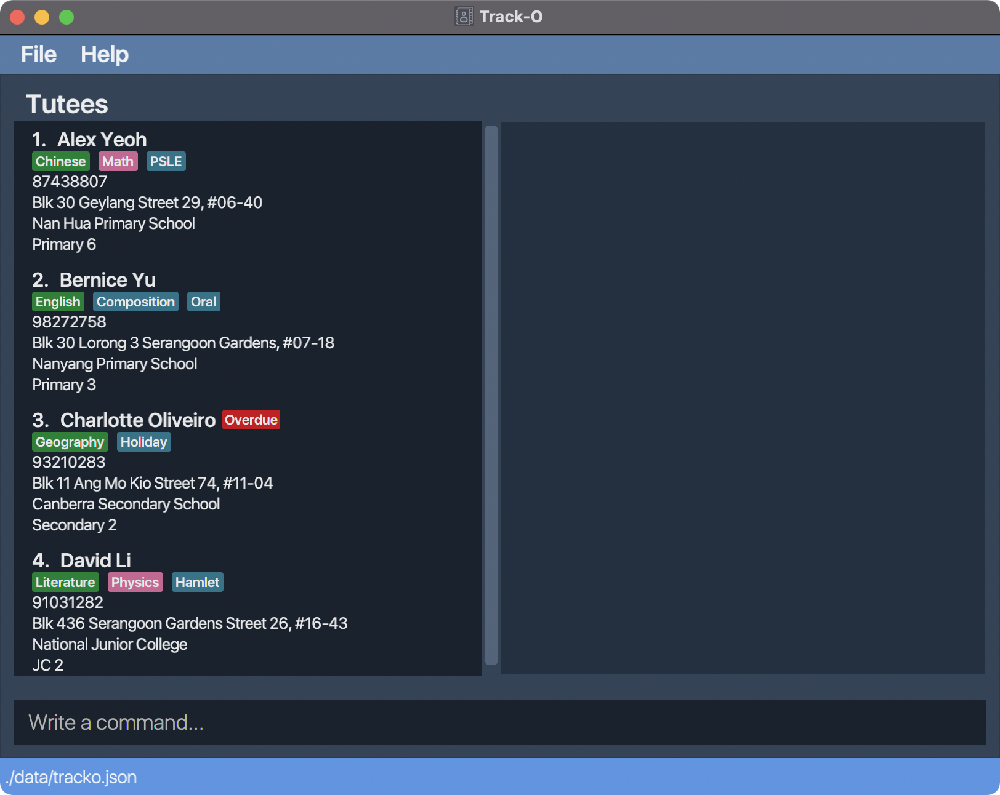
    

5. Refer to [Setting up your first tutee](#setting-up-your-first-tutee) to get started using Track-O.

If you need help with the start up process, visit our [Troubleshooting](#troubleshooting) section.

### Application layout

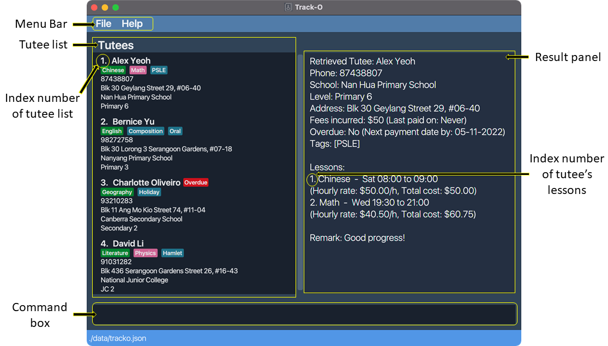

The GUI of Track-O is divided mainly into 4 sections:
- `Menu Bar`: Navigation buttons that you can click to exit Track-O or open up a `help` window containing a link to this User Guide. 
- `Tutee list`: A scrollable panel that shows a numbered list of your tutees.
  - The index number of the tutee list is the number that is assigned to each tutee in the numbered list.
- `Command box`: A text box where you can type in commands and hit the Enter key on your keyboard to execute them.
- `Result panel`: A scrollable panel that shows the result of the command that you have just executed.
  - Note that some commands such as `get` will show a particular tutee's lessons in the form of a numbered list. Similar to the tutee list, the index number of a tutee's lesson refers to the number assigned to each lesson in the numbered list.

### Setting up your first tutee

This section provides a quick guide to adding your first tutee and carrying out your first lesson. For more information
on each command, it can found under the [Features](#features) section of our guide. To run a command, simply type the command in the command box and hit the Enter key on your keyboard.

#### Before your lesson
1. Let's clear the existing sample data first. Run `clear` to remove the existing tutees.
2. To add in a new tutee, run `add n/John Tan l/p5 a/246 Hougang Ave sch/Rosyth School p/84567890`.
This will add in a tutee with the name `John Tan`, a `Primary 5` student from `Rosyth School`, staying at `246 Hougang Ave` whose phone number is `84567890`.
3. To add a lesson for this tutee, run `addlesson 1 subject/English d/7 s/14:00 e/16:00 rate/30`.
This will add an `English` lesson from `Sunday 2pm to 4pm` with the rate of `$30` per hour for John.
4. To state a payment receive date, run `payment 1 by/05-01-2022`. This means that you expect to collect the fees on
the 5th of January 2022.
5. Run `get 1`. If you performed all the steps correctly, the application should look like this.

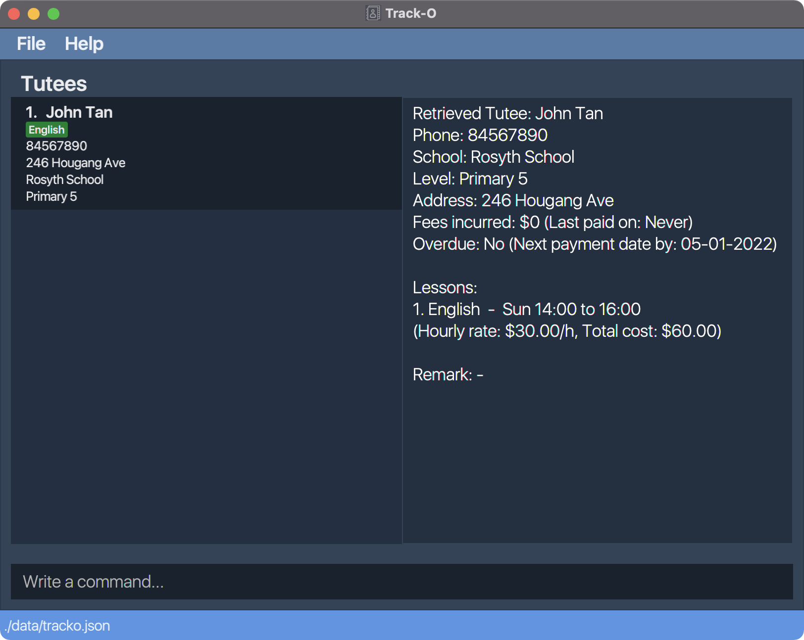

#### After your lesson
1. To add in the fees of this lesson, run `payment 1 lesson/1`. This will add in the total fees of the first lesson. Since
the rate was `$30` per hour over 2 hours, the total adds up to `$60.00`.
2. To add in any remarks for the lesson, run `remark 1 r/Good Progress!` and this set the comments `Good Progress!`
under John's remarks.
3. If you have collected the fees for this lesson, run `payment 1 receive/` and this resets the payment value to `0.00`,
removes the pay-by date used in step 4 under [Before your lesson](#before-your-lesson), and updates John's last paid date to today's date.
4. Run `get 1`. If you performed all the steps correctly, the application should look like this.

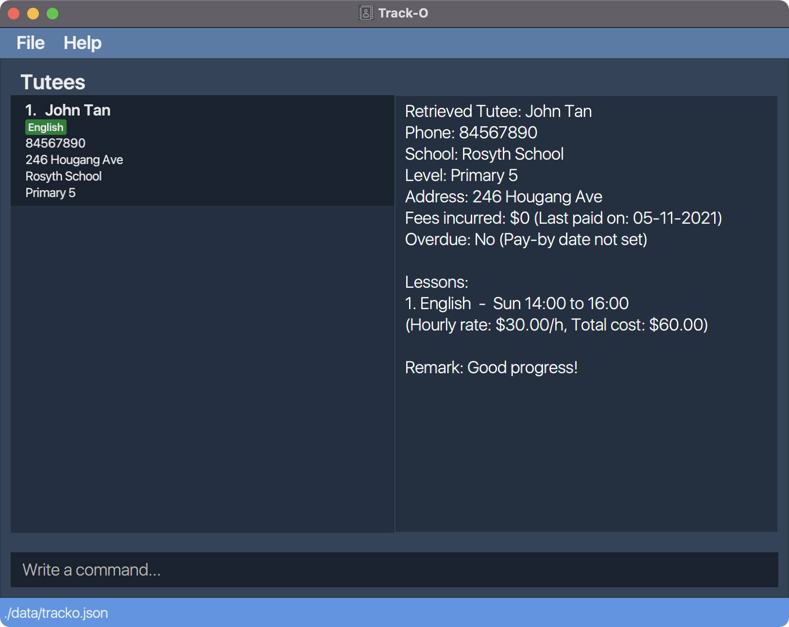

--------------------------------------------------------------------------------------------------------------------

## Features

This section covers the various features of **Track-O**. 

Our main features includes storing the information of tutees, scheduling lessons and managing payments of tutees.

**:information_source: Notes about the command format:** 

* Words in `UPPER_CASE` are the parameters to be supplied by you. 
  e.g. in `add n/NAME`, `NAME` is a parameter which can be used as `add n/John Doe`.

* Items in square brackets are optional. 
  e.g `n/NAME [t/TAG]` can be used as `n/John Doe t/friend` or as `n/John Doe`.

* Items with `…` after them can be used multiple times. 
e.g. `[t/TAG]…` tags are optional can be added multiple times: `t/friend`, `t/friend t/family` etc. 
e.g. `[subject/SUBJECT…]` subject keywords are optional and allows multiple keyword search: `subject/English Math Science`

* Parameters can be in any order. 
  e.g. if the command specifies `n/NAME p/PHONE_NUMBER`, `p/PHONE_NUMBER n/NAME` is also acceptable.

* If a parameter is expected only once in the command but you specified it multiple times, only the last occurrence of the parameter will be taken. 
  e.g. if you specify `p/12341234 p/56785678`, only `p/56785678` will be taken.

* Extraneous parameters for commands that do not take in parameters (such as `help`, `list`, `schedule`, `exit` and `clear`) will be ignored. 
  e.g. if the command specifies `help 123`, it will be interpreted as `help`.

### Viewing help : `help`

Shows a message explaining how to access the help page.

    

Format: `help`

### Managing tutee's information

#### Adding a tutee: `add`

Adds a tutee to the existing list of tutees.

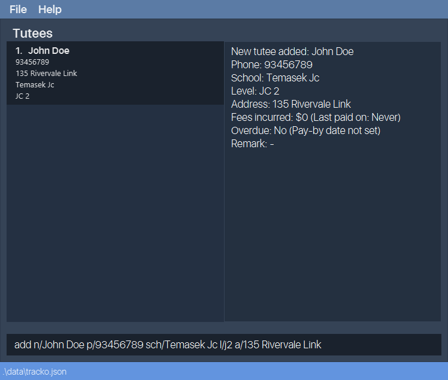

Format: `add n/NAME p/PHONE sch/SCHOOL l/LEVEL a/ADDRESS [t/TAG]…`
* `n/NAME` and `[t/TAG]` can only take in alphanumeric characters and spaces.
* `p/PHONE` should only take in 8-digit phone numbers.
* `l/LEVEL` should only take in `p1` to `p6`, `s1` to `s5`, `j1` to `j2`.

Examples:
* `add n/John Doe p/93456789 sch/Temasek Jc l/j2 a/135 Rivervale Link`
* `add n/Betsy Crowe l/p5 a/246 Hougang Ave 6 sch/Rosyth p/84567890 t/Northeast region`

#### Deleting a tutee : `delete`

Deletes the specified tutee from our list of tutees.

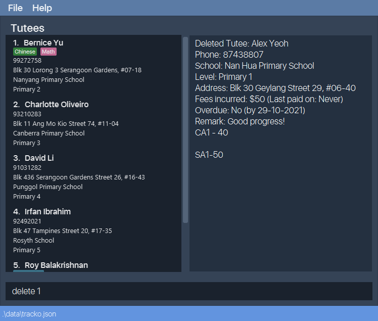

Format: `delete INDEX`

* Deletes the tutee at the specified `INDEX`.
* The index refers to the index number tagged to each tutee in the currently displayed tutee list.
* The index must be within the size of the displayed tutee list and **must be a positive integer** 1, 2, 3, …

Examples:
* `delete 2` deletes the 2nd tutee in the tutee list.

#### Editing a tutee :  `edit`

Edits an existing tutee in the tutee list.

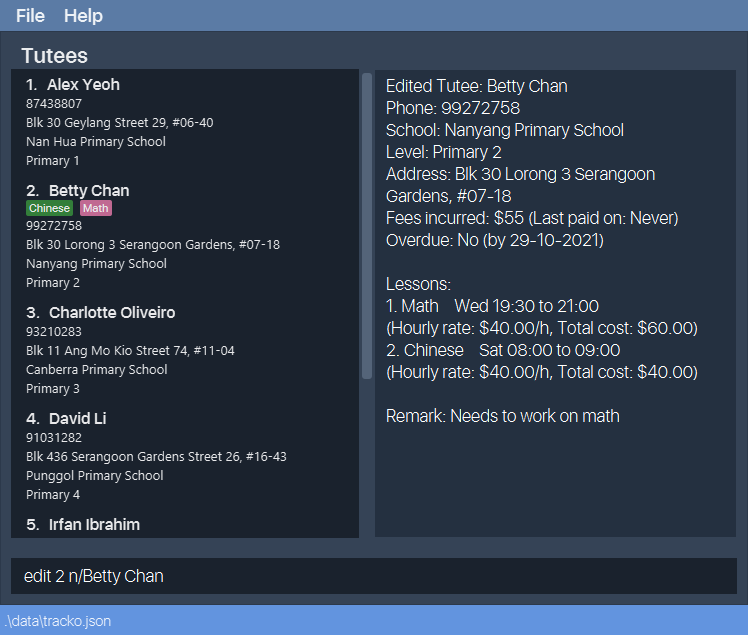

Format: `edit INDEX [n/NAME] [p/PHONE] [sch/SCHOOL] [l/LEVEL] [a/ADDRESS] [t/TAG]…`

* Edits the tutee at the specified `INDEX`.
* The index refers to the index number tagged to each tutee in the currently displayed tutee list.
* The index must be within the size of the displayed tutee list and **must be a positive integer** 1, 2, 3, …
* At least one of the optional fields must be provided.
* `n/NAME` and `[t/TAG]` can only take in alphanumeric characters and spaces.
* `p/PHONE` should only take in 8-digit phone numbers.
* `l/LEVEL` should only take in `p1` to `p6`, `s1` to `s5`, `j1` to `j2`.
* Existing values will be updated to the input values while all other values without input values remains unchanged.
* When editing tags, the existing tags of the tutee will be removed i.e adding of tags is not cumulative.
* You can remove all the tutee’s tags by typing `t/` without specifying any tags after it.

Examples:
* `edit 1 p/91234567 a/345 Bedok North Ave 3` Edits the phone number and address of the 1st tutee to be `91234567` and `345 Bedok North Ave 3` respectively.
* `edit 2 n/Betty Chan t/` Edits the name of the 2nd tutee to be `Betty Chan` and clears all existing tags.

#### Finding tutee by fields : `find`

Filters the tutee list to display matches according to keywords.

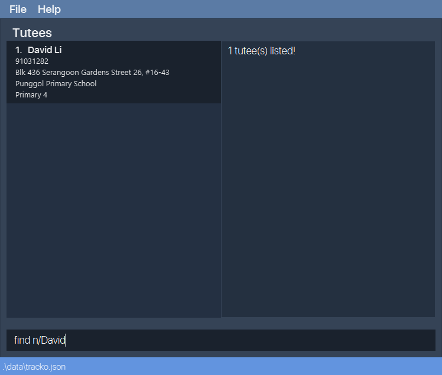

Format: `find [n/NAME…] [subject/SUBJECT…] [l/LEVEL] [overdue/OVERDUE_STATUS]`

* At least one of the optional filters must be provided.
* Keywords are case-insensitive.
* The returned tutee list contains matches that fulfills **all** the filters. If the filter has multiple keywords,
only tutees which fulfills **all** keywords will be returned.
* `name` filter can take **multiple keywords** to be matched and can only be alphanumeric characters.
* `subject` filter can take **multiple keywords** to be matched and can only be alphanumeric characters.
* `level` filter can only take **1 keyword** in the form of abbreviation. 
  e.g. `p5` for Primary 5, `s2` for Secondary 2
* `overdue` filter can only take **1 keyword**, either `yes` or `no`.

Example:
* Find all tutees with name containing `David` in the tutee list: `find n/david`.
* Find all tutees with name containing `David` and  `Lee` in the tutee list: `find n/david lee`.
* Find all tutees of level `Secondary 4`: `find l/s4`.
* Find all tutees taking `math` and `physics` classes: `find subject/math physics`.
* Find all tutees taking `math` classes with fees overdue: `find subject/math overdue/yes`.

#### Listing all tutees : `list`

Shows the full list of tutees stored.

Format: `list`

#### Get tutee's information : `get`

Gets the details of a specified tutee from the tutee list.

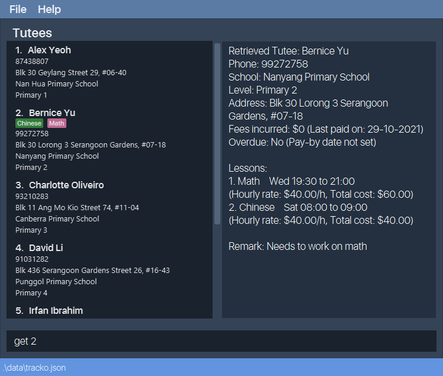

Format: `get INDEX`

* Gets the tutee at the specified `INDEX` in the format `Name: John Doe Level: P5`
* The index refers to the index number tagged to each tutee in the currently displayed tutee list.
* The index must be within the size of the displayed tutee list and **must be a positive integer** 1, 2, 3, …

Examples:
* `list` followed by `get 2` shows the 2nd tutee in the tutee list.

### Managing Remarks

#### Adding a remark to a tutee: `remark`

Adds a remark to the specified tutee with the provided `TEXT` input. New remarks will be appended to existing ones on 
a new line and will not overwrite them.

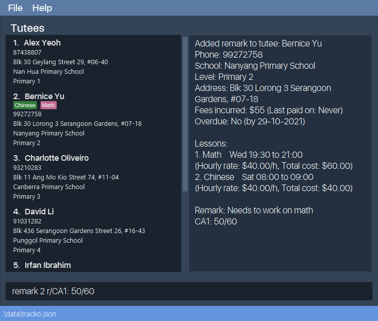

Format: `remark INDEX r/TEXT`

* Adds the desired `TEXT` to the tutee specified at the specified `INDEX`.
* The index refers to the index number tagged to each tutee in the currently displayed tutee list.
* The index must be within the size of the displayed tutee list and **must be a positive integer** 1, 2, 3, …
* Empty remarks and remarks with whitespaces allow you to skip lines when appending.

Examples:
* `remark 1 r/Went through Organic Chemistry`

#### Clearing all remarks of a tutee: `clearremark`

Clears all remarks of the specified tutee.

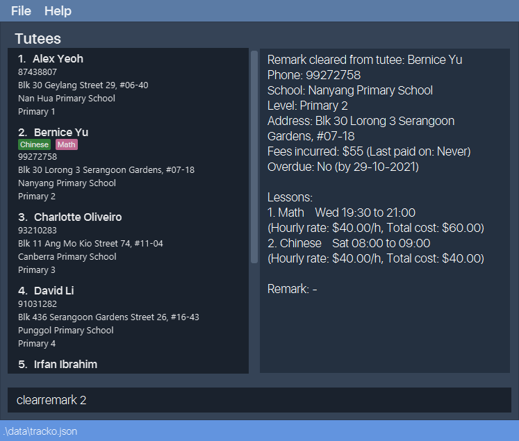

Format: `clearremark INDEX`

* Clears all remarks of the tutee specified at the specified `INDEX`.
* The index refers to the index number tagged to each tutee in the currently displayed tutee list.
* The index must be within the size of the displayed tutee list and **must be a positive integer** 1, 2, 3, …

Examples:
* `clearremark 1`

### Managing Lessons

#### Tracking lesson schedule : `schedule`

Retrieves your lesson schedule.

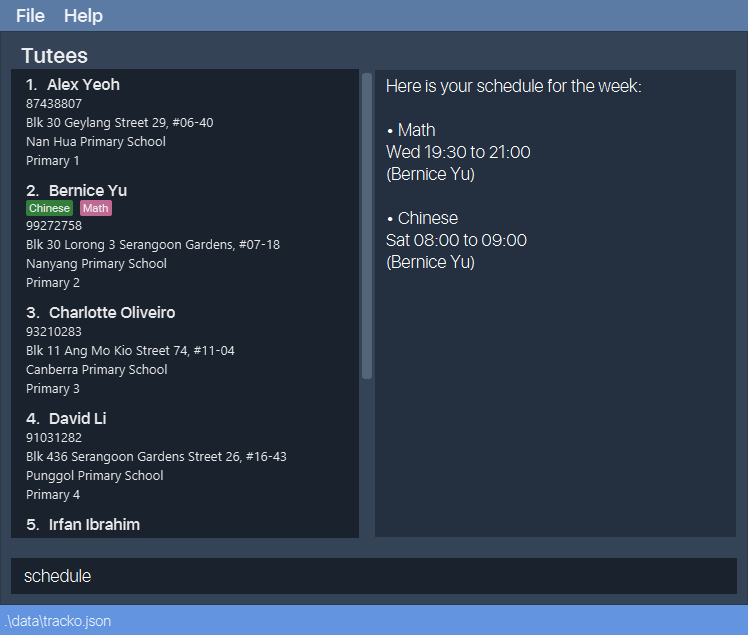

Format: `schedule`

#### Adding a lesson to a tutee : `addlesson`

Adds a lesson to the specified tutee and your current schedule.

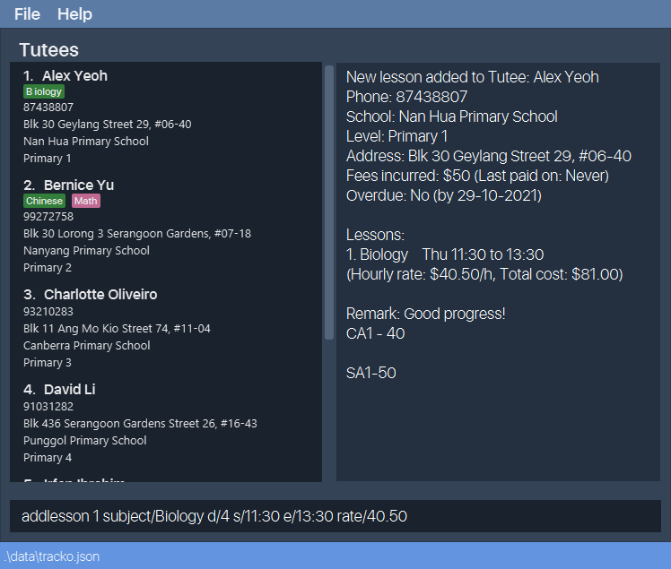

Format: `addlesson INDEX subject/SUBJECT d/DAY_OF_WEEK s/START_TIME e/END_TIME rate/HOURLY_RATE`

* Adds a lesson to the tutee at the specified `INDEX`.
* The index refers to the index number tagged to each tutee in the currently displayed tutee list.
* The index must be within the size of the displayed tutee list and **must be a positive integer** 1, 2, 3, …
* The lesson occurs on the specified `DAY_OF_WEEK`, from the specified `START_TIME` to the specified `END_TIME`, costing `HOURLY_RATE` dollars per hour.
* `DAY_OF_WEEK` **must be an integer in the range [1, 7]** where `1` to `7` corresponds to Monday to Sunday.
* `START_TIME` and `END_TIME` must be specified in an `HH:MM` format.
* The supported duration for a lesson is **30 min — 23 h 59 min**
* `START_TIME` and `END_TIME` should be within the same day.
* `HOURLY_RATE` **must be a positive number** expressed in either zero decimal places or two decimal places with the last decimal place (i.e. last digit) being `0` or `5`.
* `HOURLY_RATE` should not have a fee greater than `$1000`.
* The lesson to be added must not clash with any of the lessons in your schedule.

Examples:
* `addlesson 1 subject/Biology d/7 s/11:30 e/13:30 rate/40.50`
* `addlesson 2 subject/Math d/5 s/19:30 e/21:30 rate/40.75`
* `addlesson 3 subject/Chemistry d/7 s/08:30 e/09:45 rate/40`

#### Deleting a lesson from a tutee : `deletelesson`

Deletes an existing lesson from your tutee and from your schedule.

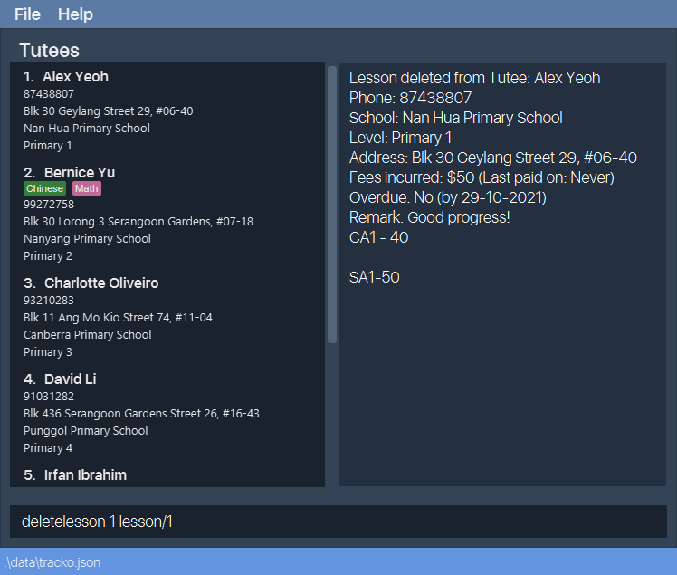

Format: `deletelesson TUTEE_INDEX lesson/LESSON_INDEX`

* The index refers to the index number tagged to each tutee in the currently displayed tutee list.
* The index must be within the size of the displayed tutee list and **must be a positive integer** 1, 2, 3, …
* The lesson index is the number displayed beside the subject name after using `get` command on the tutee.
* `TUTEE_INDEX` and `LESSON_INDEX` are compulsory fields, an error message is produced if either one is missing.

Examples:
* Deleting **lesson 2** from **tutee 3**:
  `deletelesson 3 lesson/2`
* Deleting **lesson 3** from **tutee 1**:
  `deletelesson 1 lesson/3`

### Tracking Payments

Entering `payment` shows you all the payment-related commands available. 
Note that Track-O keeps track of fees up to $100,000, any payment command that results in the fees exceeding the amount will return an error.

#### Retrieve payment details from tutee: `payment`

Format: `payment INDEX`

* Retrieves the payment details of the tutee at the specified `INDEX`.
* The index refers to the index number tagged to each tutee in the currently displayed tutee list.
* The index must be within the size of the displayed tutee list and **must be a positive integer** 1, 2, 3, …

Examples:
* `payment 1`

#### Adding lesson's fees to a tutee: `… lesson`

Format: `payment INDEX lesson/LESSON_INDEX`

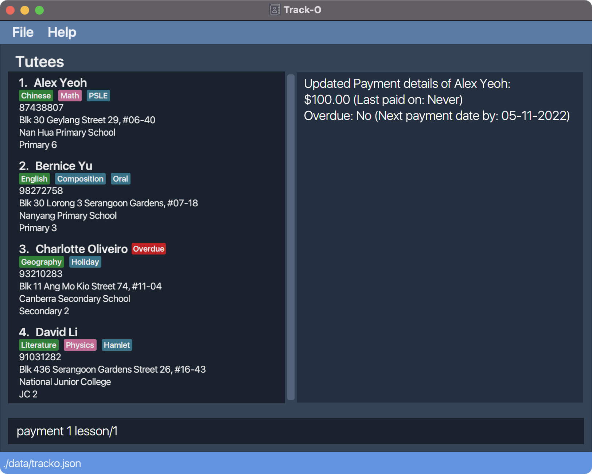

* Adds the fees of the specified lesson at `LESSON_INDEX` to the specified tutee's payment details at `INDEX`.
* The index refers to the index number tagged to each tutee in the currently displayed tutee list.
* The index must be within the size of the displayed tutee list and **must be a positive integer** 1, 2, 3, …
* `LESSON_INDEX` must be within the size of the tutee's lesson list and **must be a positive integer** 1, 2, 3, …
* If the payment amount exceeds $100,000 after adding the lesson fees, Track-O returns an error message.

Examples:
* `payment 1 lesson/1`
* `payment 1 lesson/2`

#### Editing a tutee's payment amount: `… amount`

Format: `payment INDEX amount/AMOUNT`

* Changes the payment amount due by the specified tutee at `INDEX` to `AMOUNT`.
* The index refers to the index number tagged to each tutee in the currently displayed tutee list.
* The index must be within the size of the displayed tutee list and **must be a positive integer** 1, 2, 3, …
* `AMOUNT` **must be from 0 to 100,000** expressed in either zero decimal places or two decimal places with the last decimal place (i.e. last digit) being `0` or `5`.

Examples:
* `payment 1 amount/0`
* `payment 1 amount/80.50`
* `payment 2 amount/100`

#### Setting a tutee's payment due date: `… by`

Format: `payment INDEX by/DUE_DATE`

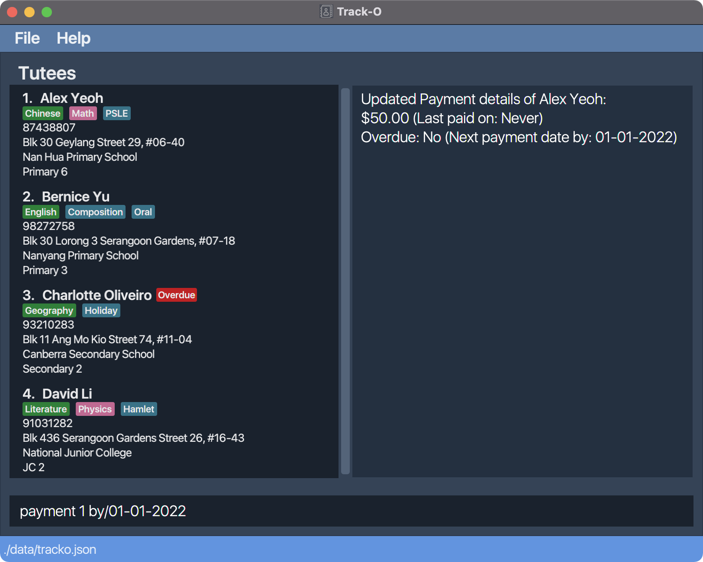

* Changes the payment due date of the specified tutee at `INDEX` to `DUE_DATE`.
* The index refers to the index number tagged to each tutee in the currently displayed tutee list.
* The index must be within the size of the displayed tutee list and **must be a positive integer** 1, 2, 3, …
* `DUE_DATE` **must be later than or on the current date** expressed in the `dd-MM-YYYY` format.

Examples:
* `payment 1 by/25-12-2021`
* `payment 2 by/01-01-2022`

#### Receiving a tutee's payment (and setting a next payment due date): `… receive`

Format: `payment INDEX receive/[DUE_DATE]`

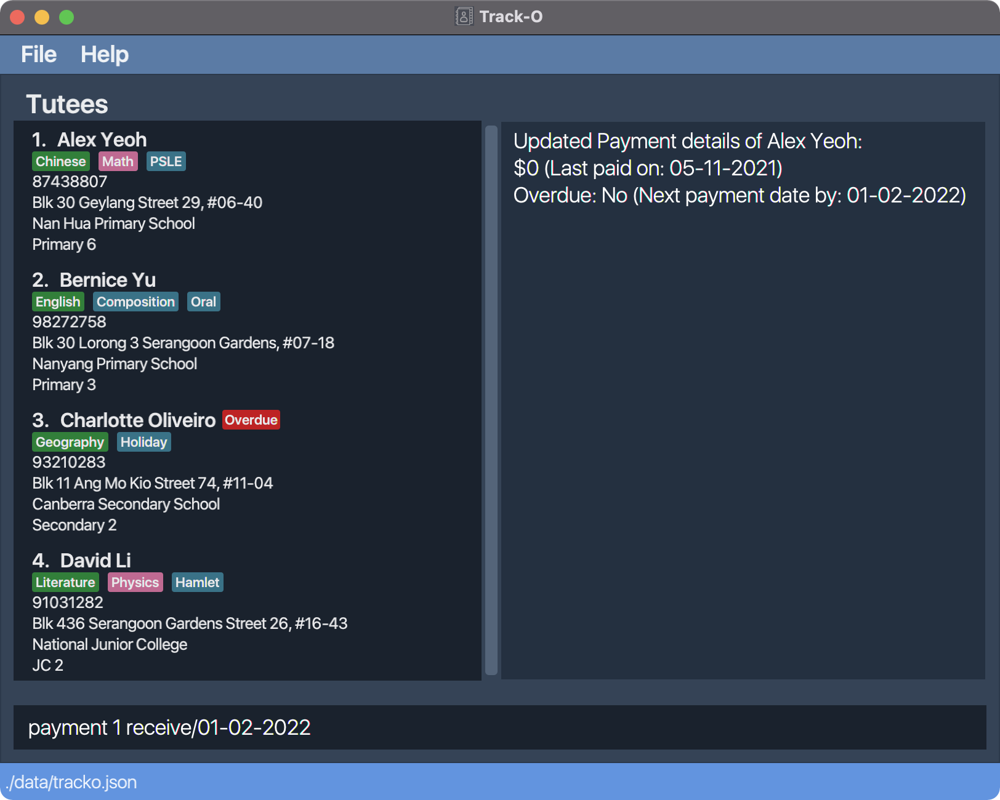

* Resets the payment amount due of the specified tutee to `0`.
* Resets the payment due date of the specified tutee at `INDEX` to `-`, or `DUE_DATE` if specified.
* Updates the specified tutee's last paid date in their payment details to the current date.
* The index refers to the index number tagged to each tutee in the currently displayed tutee list.
* The index must be within the size of the displayed tutee list and **must be a positive integer** 1, 2, 3, …
* `DUE_DATE` **must be later than or on the current date** expressed in the `dd-MM-YYYY` format, if specified.

Examples:
* `payment 1 receive/`
* `payment 2 receive/01-01-2022`

### Clearing all entries : `clear`

Clears the tutee list and your schedule.

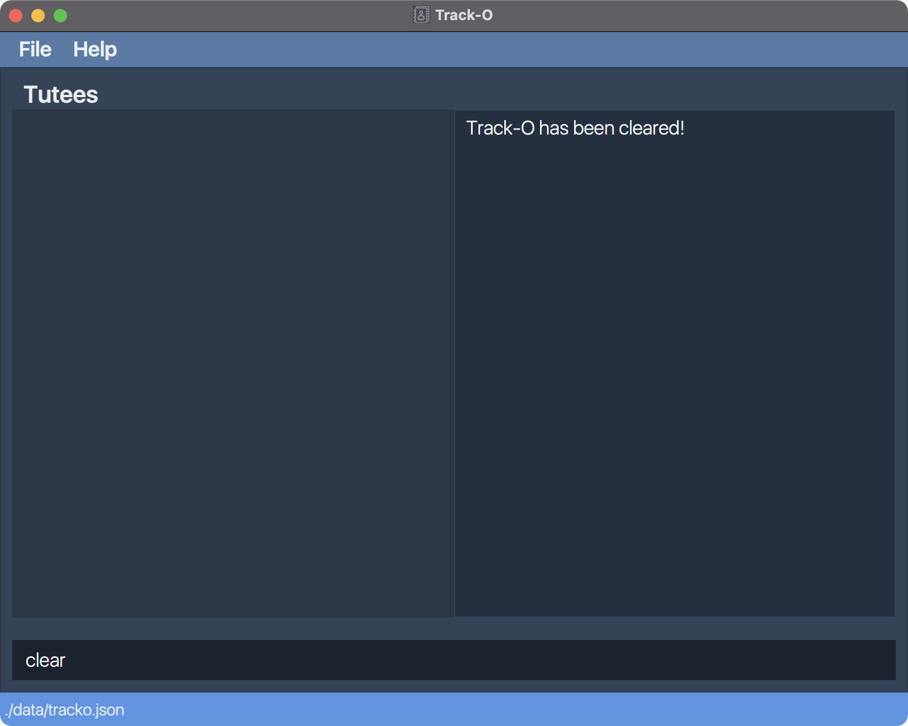

Format: `clear`

### Exiting application : `exit`

Exits from the application.

Format: `exit`

--------------------------------------------------------------------------------------------------------------------

## Command summary

Action | Format, Examples
--------|------------------
**Help** | `help`
**Add tutee** | `add n/NAME p/PHONE sch/SCHOOL l/LEVEL a/ADDRESS [t/TAG]…`   e.g. `add n/James Ho p/87652345 sch/Anderson sec l/s4 a/200 Yio Chu Kang Road`
**Delete tutee** | `delete INDEX`  e.g. `delete 3`
**Edit tutee** | `edit INDEX [n/NAME] [p/PHONE] [sch/SCHOOL] [l/LEVEL] [a/ADDRESS] [t/TAG]…`   e.g. `edit 2 sch/Victoria Jc l/j1`
**Find tutee** | `find [n/NAME…] [l/LEVEL] [subject/SUBJECT…] [overdue/OVERDUE]`  e.g `find n/david subject/math`
**List all tutees** | `list`
**Get tutee information** | `get INDEX`  e.g. `get 2`
**Add remark** | `remark INDEX r/TEXT`   e.g `remark 1 r/Good progress.`
**Clear remarks** | `clearremark INDEX`   e.g `clearremark 1`
**View schedule** | `schedule`
**Add lesson to tutee** | `addlesson INDEX subject/SUBJECT d/DAY_OF_WEEK s/START_TIME e/END_TIME rate/HOURLY_RATE`   e.g `addlesson 1 subject/Biology d/4 s/11:30 e/13:30 rate/40.50`
**Delete Lesson from tutee** | `deletelesson TUTEE_INDEX lesson/LESSON_INDEX`  e.g `deletelesson 2 lesson/1`
**View payment details** | `payment INDEX`   e.g `payment 1`
**Add payment due** | `payment INDEX lesson/LESSON_INDEX`   e.g `payment 1 lesson/1`
**Edit payment due** | `payment INDEX amount/AMOUNT`   e.g `payment 1 amount/80.50`
**Set payment date** | `payment INDEX by/DUE_DATE`   e.g `payment 1 by/01-01-2022`
**Receive payment** | `payment INDEX receive/[DUE_DATE]`   e.g `payment 1 receive/01-02-2022`
**Clear** | `clear`
**Exit** | `exit`

--------------------------------------------------------------------------------------------------------------------

## FAQ

**Q**: How do I transfer my data to another Computer? 
**A**: Install the app in the other computer and overwrite the empty data file it creates with the file that contains the data of your previous Track-O home folder (`tracko.json`).

**Q**: I opened my application and all my data is gone! What do I do? 
**A**: The data is most likely corrupted. If you are familiar with how to edit `json` files, you may open your `tracko.json` file to make the necessary edits. Otherwise, you would have to delete the existing `tracko.json` file and start afresh.

**Q**: Why does my application look slightly different? 
**A**: The screenshots in this User Guide are from an application running on macOS. If you are using Windows, your application would look something like this instead:

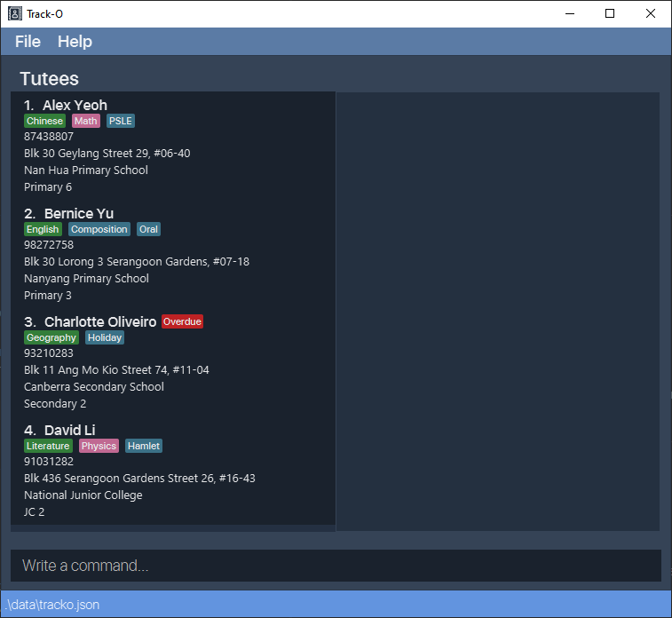

It is just a visual difference. Both applications have the same functionalities otherwise.

**Q**: What are tags used for?  
**A**: Tags can be used to indicate important details of the tutee that you would like to see straight from the `tuteelist`. For instance, in the sample data provided, tags were used to indicate important upcoming examinations for tutees such as `PSLE`. 

**Q**: What does it mean by a lesson clashing with other lessons in the user's schedule under the section on [adding a lesson to a tutee](#adding-a-lesson-to-a-tutee--addlesson)? Why is it not allowed? 
**A**: A schedule clash means that the lesson added coincides with another lesson in the existing schedule. To resolve this, pick a different day/timing where your schedule is free.

**Q**: Why doesn't pressing `F1` open the Help menu on my Mac? 
**A**: Try pressing `Fn` + `F1` (The Function and the F1 key together) instead. This is due to how macOS handles function keys.

--------------------------------------------------------------------------------------------------------------------

## Troubleshooting

### Installing Java 11

If you do not have Java 11 installed and are unsure of which version to download, refer to the follow steps:
1. Visit the Oracle website [here](https://www.oracle.com/java/technologies/downloads/#java11).
2. Scroll down until you see **Java SE Development Kit 11.0.13**. You should see something similar to the image below.

    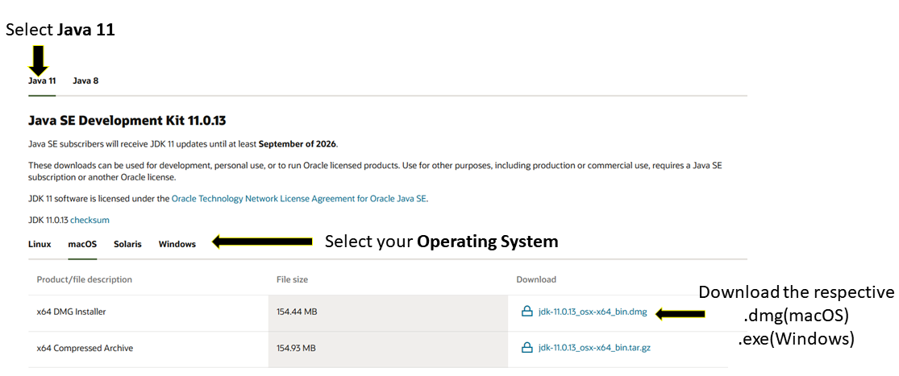

3. Click on **Java 11**.
4. Select your own Operating System. You may check your computer's [System Information](https://kb.wisc.edu/helpdesk/page.php?id=8208) for more details.
5. Download the respective file. (You may need to register for an Oracle account) 
   1. For macOS users, download the file that ends with **.dmg**.
   2. For Windows users, download the file that ends with **.exe**.
   3. For Linux users, follow the instructions [here](https://docs.oracle.com/en/java/javase/11/install/installation-jdk-linux-platforms.html#GUID-4907E1A6-7B4B-4E98-9DA5-BF2A4D01AA57)
   to download Java 11.
6. For macOS and Windows users, once the **.dmg** or **.exe** file has been installed, double-click the file and follow the instructions provided to complete the installation.

### Installing Track-O (macOS)

For macOS users, you may receive an error similar to the one below when double-clicking **tracko.jar** for the first time.

    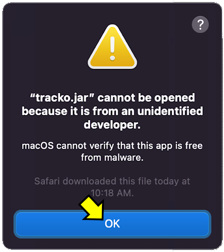

 
Refer to the following steps to get started using Track-O:
1. Click on the "OK" to close the pop-up window.
2. Run **Spotlight** by pressing the Command key and Space Bar at the same time.
3. Type "Security & Privacy" and hit Enter. You should see a window similar to the one below:

    

        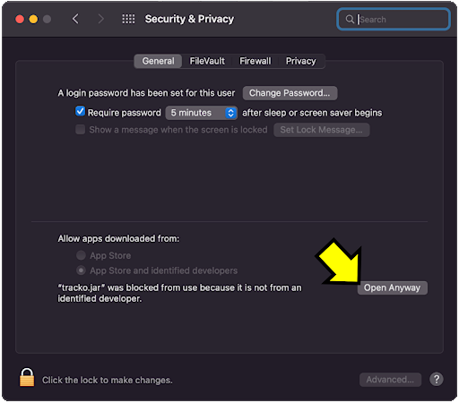
    

5. Click on "Open Anyway" and a new window similar to the one below will pop up. 

    

        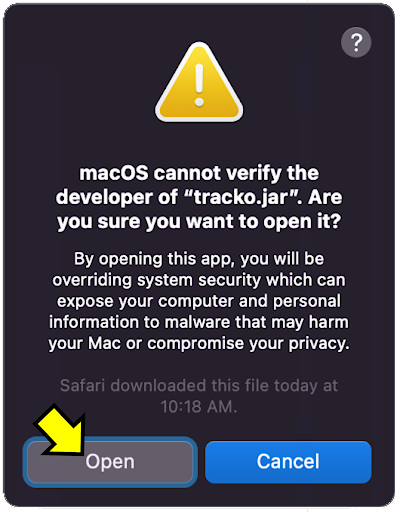
    

6. Click on "Open" and Track-O will start.

--------------------------------------------------------------------------------------------------------------------

## Glossary

Terms | Explanation
--------|------------------
operating system | The system software that manages computer hardware.
command | The text that you enter in the command box. Different commands have different formats.
prefix | A word or letter that ends with `/`. It is a shorthand notation that is used to specify the fields involved in a command. e.g. `n/` indicates that a name is involved.
parameter | A value that is defined based on your input and is immediately preceded by a prefix. e.g. Given a `p/` prefix which represents a phone number, followed by a `PHONE` parameter; if you input `98765432` in place of the `PHONE` parameter, the phone number holds a value of `98765432`.
alphanumeric characters | Words that consist of only English alphabets and/or numbers, e.g. `2km`. Characters such as `@`, `?` and `%` are not alphanumeric. 
integer | A number that has no decimal places or fractions.
level | Refers to the education level of a student in the context of Singapore's education system.
