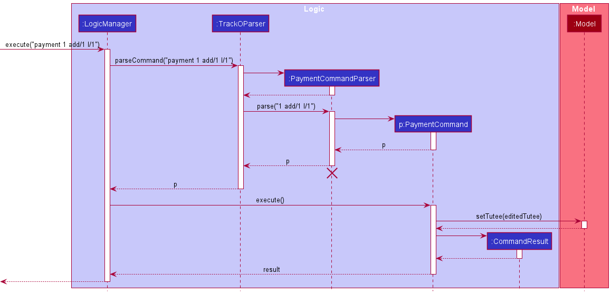

atyhamos.md---
layout: page
title: Amos' Project Portfolio Page
---

### Project: Track-O

Track-O is a desktop address book application used by private tutors to schedule lessons and track payments. The user interacts with it using a CLI, and it has a GUI created with JavaFX. It is written in Java, and has about 10 kLoC.

Given below are my contributions to the project.

* **Tracking payments**: Added the ability to track payments for Tutees.
  * What it does: allows the user to store payment amounts due by their tutees and keep track of the due date.
  * Justification: This feature implements a core functionality for the application as tutors need not rely on manual bookkeeping, reducing mistakes in calculations and providing more convenience to the users.
  * Highlights: This enhancement affects existing commands and commands to be added in future, such as `PaymentAddCommand` and `PaymentSetAmountCommand`. 
  It required an in-depth analysis of design alternatives, especially in regard to how the payment amount would be accumulated by the tutee and how the user would track it.
    
  For example, initial plans involved having a fixed payment due date of 1 week since a payment was made, to be calculated automatically using `LocalDate`, but considering not all tutors collect their fees weekly, the final design let them set their own payment due dates. 
  * The implementation was challenging too as it required changes to existing commands, such as `AddCommand`, and modifications to the `JsonAdaptedTutee` to store payment information in the .json file.
  * Credits: *-*

* **Revamped GUI**: Updated the GUI completely to better suit the application's vision and the intended user's workflow.
  * What it does: allows the user to view their list of tutees on the left panel, while managing all their necessary information on the right panel.
    In detail:
    1. Changed overall colour theme and fonts to fit a more modern application's aesthetic
    2. Increased size and changed position of result display to fit more useful information.
    3. Reduced size of tutee list display due to excess, unused space
    4. Added different coloured subject labels to tutee cards for easy identification
    5. Added red coloured Overdue label to indicate tutees with overdue payments
  * Justification: The improvements to GUI accommodates the other features implemented, such as `Subject` and `Payment` with subject and Overdue labels,
  and provides a more appealing interface for the user to view tutees at a glance and interact with the application.
  * Highlights: This enhancement did not affect existing commands and commands to be added in future, but did affect code coverage as Ui classes were not extensively tested in AB3.
    `TuteeCardTest` was created to improve code coverage and testing for the `TuteeCard` class, where most of the changes took place.
  Difficulties arose as testing the `TuteeCard` class required JavaFX, but a workaround was used after researching on the Internet.
  * Credits: *https://stackoverflow.com/a/38883519*
  
* **Code contributed**: [RepoSense link](https://nus-cs2103-ay2122s1.github.io/tp-dashboard/?search=&sort=groupTitle&sortWithin=title&timeframe=commit&mergegroup=&groupSelect=groupByRepos&breakdown=true&checkedFileTypes=docs~functional-code~test-code~other&since=2021-09-17&tabOpen=true&tabType=authorship&tabAuthor=atyhamos&tabRepo=AY2122S1-CS2103T-F12-3%2Ftp%5Bmaster%5D&authorshipIsMergeGroup=false&authorshipFileTypes=docs~functional-code~test-code~other&authorshipIsBinaryFileTypeChecked=false)

* **Project management**:
  * Managed releases `v1.3` and `v1.3.1` (2 releases) on GitHub

* **Enhancements to existing features**:
  * Updated the GUI color scheme (Pull request [\#36](https://github.com/AY2122S1-CS2103T-F12-3/tp/pull/36))

* **Documentation**:
  * User Guide:
    * Added documentation for the `payment` feature and its respective sub-commands (Pull request [\#89](https://github.com/AY2122S1-CS2103T-F12-3/tp/pull/89))
  * Developer Guide:
    * Added implementation details of the `payment` feature and payment tracking (Pull request [\#55](https://github.com/AY2122S1-CS2103T-F12-3/tp/pull/55)), including:
      * Object diagram of how a `Tutee` updates its `Payment` with respective commands by the user
       
      * Sequence diagram of how a `PaymentCommand` is parsed from the user's input and executed to facilitate payment tracking
       
      
* **Community**:
  * PRs reviewed (with non-trivial review comments): [\#58](https://github.com/AY2122S1-CS2103T-F12-3/tp/pull/58), 
  [\#71](https://github.com/AY2122S1-CS2103T-F12-3/tp/pull/71),
  [\#74](https://github.com/AY2122S1-CS2103T-F12-3/tp/pull/74),
  [\#88](https://github.com/AY2122S1-CS2103T-F12-3/tp/pull/88),
  [\#90](https://github.com/AY2122S1-CS2103T-F12-3/tp/pull/90)
  * Designed team's application icon:
    * For Application tray: 
    * For website viewing:
    
